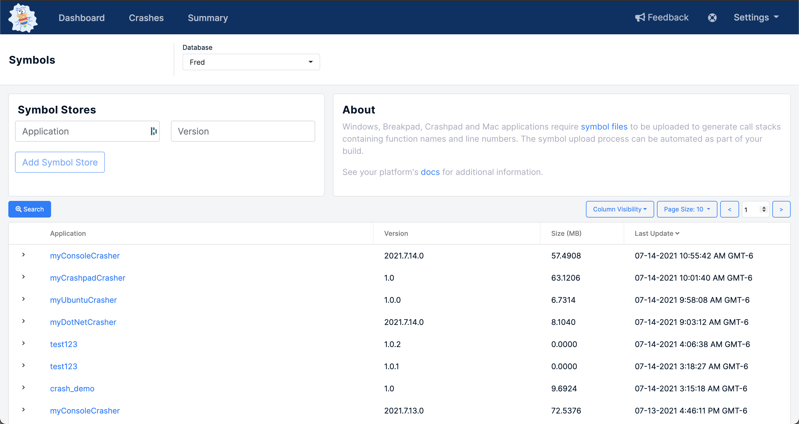

# Symbol Files

Symbol files are a critical component of getting useful data from your crashes. Windows, Breakpad, Crashpad, Mac, and some JavaScript applications require [symbol files](./) to be uploaded to generate call stacks containing function names and line numbers. The symbol upload process can be automated as part of your build. Symbols are required by many of our SDKs and can be uploaded and managed via the [Versions](https://app.bugsplat.com/v2/versions) page. 

For additional information regarding Symbol files, please visit the [documentation](../../../) specific to your application's platform

### What are Symbols?

Symbols are files that contain information to map information in the minidump file to file names and line numbers in source code.

### Using Symbols

For Windows [C++](../../getting-started/integrations/desktop/cplusplus/) and [.NET](../../getting-started/integrations/cross-platform/dot-net-standard.md) applications, symbols are files with **.exe**, **.pdb** and **.dll** extensions and can be uploaded automatically via [SendPdbs](../../../education/faq/using-sendpdbs-to-automatically-upload-symbol-files.md).

For [Crashpad](../../getting-started/integrations/cross-platform/crashpad/) applications, symbols are files with **.sym** extensions and can be uploaded automatically via [symupload](https://github.com/google/breakpad/blob/main/docs/processor_design.md#processing).

For [macOS](../../getting-started/integrations/desktop/macos.md) applications, symbols are files with **.app** and **.dSYM** extensions and can be uploaded automatically in a post-archive build action.

For TypeScript and [JavaScript](../../getting-started/integrations/web/javascript.md) applications, symbols are files with a **.js.map** extension and can be uploaded automatically via [@bugsplat/symbol-upload](https://www.npmjs.com/package/@bugsplat/symbol-upload).

## Additional Resources







