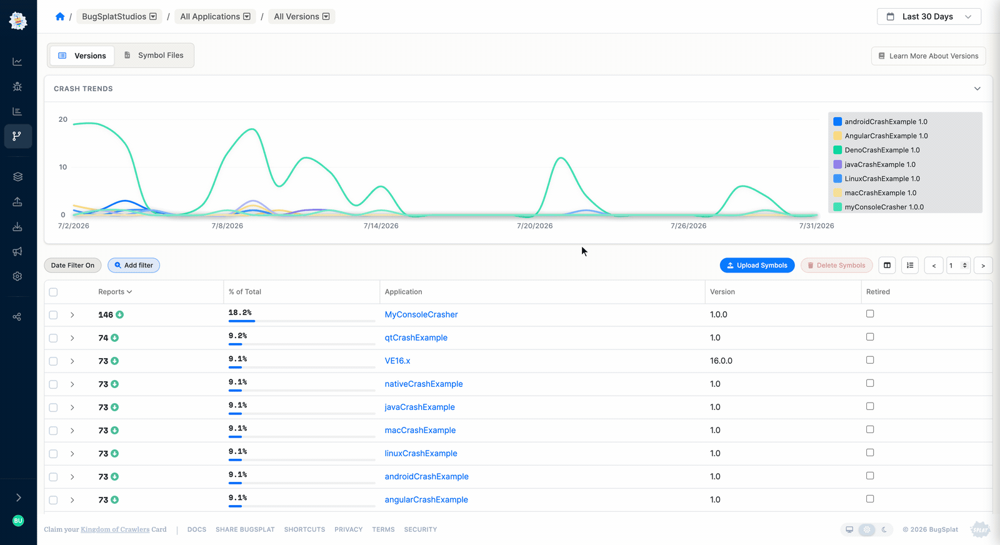

# Managing Symbol Storage

Symbols consume storage space in your account, so removing unused symbols helps reduce storage costs. BugSplat automatically removes symbols that haven't been referenced recently, and you can also remove them manually at any time. BugSplat customers are responsible for retaining their own long-term copies of symbol files.

For many customers, the automatic rules need no further explanation. If your symbol storage space is large and you'd like to optimize costs, read on.

### Symbol Stores

When you upload symbols to BugSplat, a **symbol store** is created. A [symbol store](../../../education/bugsplat-terminology.md#symbol-store) is a collection of symbols identified by their application name and version. BugSplat groups these symbols together for easy reference and management.

### Automatic Cleanup

Once a database contains more than **5 GB** of symbol data, our cleanup algorithm will automatically remove symbols that have not been referenced recently. Symbol files shared between symbol stores (i.e., uploaded multiple times) are only deleted when no symbol store references the file.

**Cleanup Rules**

1. Symbol stores not referenced by a crash report in more than the configured expiry period (default **90 days**) will be removed.
2. New symbol stores not referenced by a crash report within **15 days** will be removed.
3. Individual symbol files not accessed in more than the configured expiry period (default **90 days**) will be removed.


You can configure the symbol expiry period for your database on the [Symbols](https://app.bugsplat.com/v2/database/symbols) settings page. The default value is 90 days.



Avoid uploading common symbols with every build. Library symbols that change infrequently should be placed in a dedicated symbol store rather than being re-uploaded with each new build of your application. This allows the 15-day "new symbol store" rule to remove individual builds that aren't referenced and ensures more efficient cleanup.


### Manual Removal

You can remove symbol stores at any time from the [Versions](https://app.bugsplat.com/v2/versions) page. Select the checkbox next to the versions containing the symbols you want to remove, then click the **Delete Symbols** button. The application name/version row won't be deleted, but it will show a size of zero.

<figure><figcaption>
Removing Symbols Manually
</figcaption></figure>

You can also remove a symbol store from your build machine by invoking [symbol-upload](upload-symbols-with-symbol-upload.md) with the `-r` flag.

### Managing Symbols with the API

If BugSplat's automatic cleanup rules aren't optimal for your team, you can implement your own cleanup logic using the [BugSplat API](../web-services/api/).

### Best Practices

* **Assign a unique version to each build.** This lets BugSplat's automatic cleanup rules remove symbols specific to builds that are no longer referenced.
* **Upload only necessary symbols.** Avoid uploading redundant symbols to keep your symbol space lean.
* **Monitor symbol usage.** Keep an eye on the size of your symbol data and how often symbols are accessed so you can anticipate when automatic cleanup will occur.
* **Use manual removal when needed.** Periodically review your symbol stores and delete those you no longer need.
