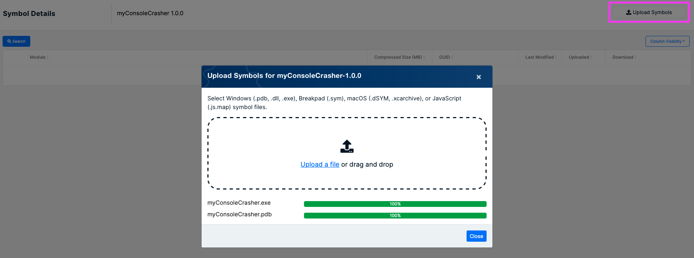

# How to Manually Upload Symbols

#### Step 1

Create a symbol store on the [Symbols](https://app.bugsplat.com/v2/symbols) page.

#### Step 2

Click the link that appears in the Application column of the table below to navigate to the Symbol Details page.

#### Step 3

On the Symbol Details page, click the Upload Symbols button.

#### Step 4

Select all symbol files that correspond to your application. Windows symbol files have a .exe, .dll or .pdb file extension. MacOS requires uploading the entire .xcarchive file. Crashpad and Breakpad symbol files have a .sym file extension.

#### Step 5

Once the Close button becomes enabled you can click it to safely dismiss the Upload dialog.

