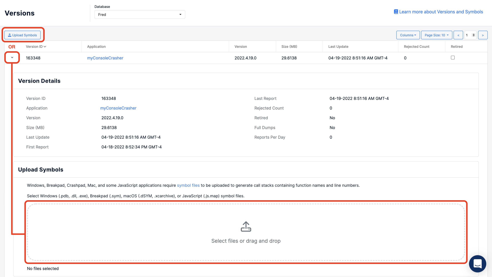

# How to Manually Upload Symbols

[Symbols](../../../education/bugsplat-terminology.md#symbols) are used to display the original source code function names and line numbers from the [call stacks](../../../education/bugsplat-terminology.md#call-stack) of compiled applications.

## Step 1

Navigate to the [Versions](https://app.bugsplat.com/v2/versions) page.

## Step 2

Click the **Upload Symbols** button to open the Symbol Upload modal. Alternatively, you can expand a row in the table and upload symbols to an existing version.

## Step 3

Enter values in the **Application** and **Version** fields if they are displayed. These values __must__ match the application and version values you used to configure BugSplat in your application.

## Step 4

Drag and drop the files you would like to upload, or use the **Select Files** link to choose the files in your system file explorer.

Choose all of the symbol files that correspond to your application. Windows symbol files have `.exe`, `.dll`, and `.pdb` file extensions. MacOS symbol files can be extracted from a `.xcarchive` (must be zipped before uploading), or you can upload `.dSYM` files. Crashpad and Breakpad symbol files have a `.sym` file extension. TypeScript and JavaScript symbol files have a `.js.map` extension.

## Step 5

Symbols that have been uploaded successfully will display a green checkmark next to their names. Once all files have been uploaded the Close button will be enabled and you can safely close the dialog.

