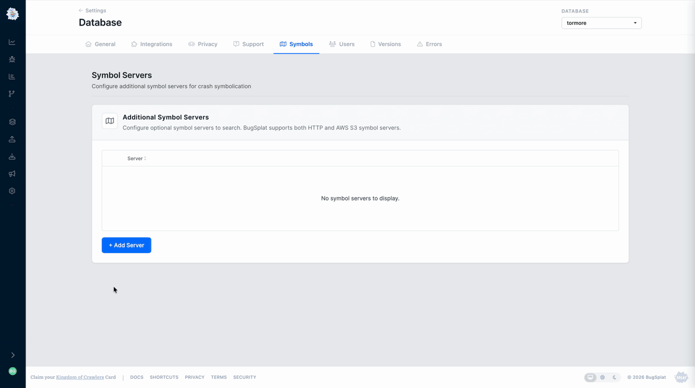

# Symbol Servers

BugSplat can process crashes using symbol files stored in external symbol servers. BugSplat supports accessing HTTP/HTTPS servers and Amazon S3 Buckets. BugSplat caches files from external symbol servers, ensuring fast crash calculation. Please note that if BugSplat requests a file not present on your external symbol server, it will not try to access the file again for 24 hours.


Some organizations restrict access to their symbol servers by IP address. To allow access to BugSplat, add the IP addresses [23.22.79.2](https://www.whatismyip.com/23.22.79.2/?iref=home), [3.93.104.250](https://us-east-1.console.aws.amazon.com/ec2/home?region=us-east-1#ElasticIpDetails:AllocationId=eipalloc-0da0d84b88eed6812), and [34.194.164.107](https://us-east-1.console.aws.amazon.com/ec2/home?region=us-east-1#ElasticIpDetails:AllocationId=eipalloc-0cd966956c064a2e4) to your whitelist.


### Directory Structure

The [symbol-upload](../../../education/faq/how-to-upload-symbol-files-with-symbol-upload.md) tool can be used to create a [SymSrv](https://learn.microsoft.com/en-us/windows/win32/debug/symbol-servers-and-symbol-stores) directory structure for Windows symbols that is compatible with both BugSplat and [Microsoft Visual Studio](https://learn.microsoft.com/en-us/visualstudio/debugger/specify-symbol-dot-pdb-and-source-files-in-the-visual-studio-debugger?view=vs-2022#configure-location-of-symbol-files-and-loading-options). Additionally, symbol-upload can also create a SymSrv directory structure for macOS and Crashpad symbols that is compatible with BugSplat.

To upload symbols to a local directory, provide the `-l` flag and a path where the symbols will be copied.

```bash
symbol-upload -f "**/*.{pdb,exe,dll}" -l "C:\path\to\output"
```

### HTTPS

BugSplat can access symbol files over HTTPS. This method also supports [Windows SymStore/SymProxy](https://learn.microsoft.com/en-us/windows-hardware/drivers/debugger/symbol-stores-and-symbol-servers) symbol servers. To connect an HTTPS symbol server to BugSplat, navigate to the [Symbols](https://app.bugsplat.com/v2/database/symbols?) page. Click the **+ Add Server** button, and add a **Host** value.

For symbol servers hosted on Azure, you'll need to generate a [Personal Access Token](https://learn.microsoft.com/en-us/azure/devops/organizations/accounts/use-personal-access-tokens-to-authenticate?view=azure-devops\&tabs=Windows#create-a-pat) that has the **Symbols (read)** scope. Enter your **Username** and use the PAT for **Password**. Optionally, you may test the connection to your server by providing a path relative to the **Host** URL.

When testing a path, BugSplat will make a **HEAD** request to **http\[s]://username:token@your-server.com/path/to/test.pdb**. Please ensure your server accepts **HEAD** requests with Basic Authentication to access this path.

<figure><figcaption></figcaption></figure>

### AWS S3

For AWS S3 symbol servers, create a minimally permissive [IAM User](https://docs.aws.amazon.com/IAM/latest/UserGuide/id_users_create.html#id_users_create_console) so BugSplat can access your S3 bucket. Modify this example policy and attach it to your newly created IAM User.

```json
{
    "Version": "2012-10-17",
    "Statement": [
        {
            "Sid": "VisualEditor0",
            "Effect": "Allow",
            "Action": [
                "s3:GetObject",
                "s3:ListBucket"
            ],
            "Resource": [
                "arn:aws:s3:::{your-s3-bucket}",
                "arn:aws:s3:::{your-s3-bucket}/*"
            ]
        }
    ]
}
```

Once you create your IAM user, generate an [access key/secret](https://docs.aws.amazon.com/IAM/latest/UserGuide/id_credentials_access-keys.html) to allow BugSplat to access your S3 bucket. Navigate to the [Symbols](https://app.bugsplat.com/v2/database/symbols) page and click **+ Add Server**. Select **AWS-S3** in the **Type** dropdown. Enter values for **URL**, **Region**, **Access Key**, **Secret Key**, and click **OK.**

<figure><figcaption><p>Adding an External S3 Symbol Server</p></figcaption></figure>
