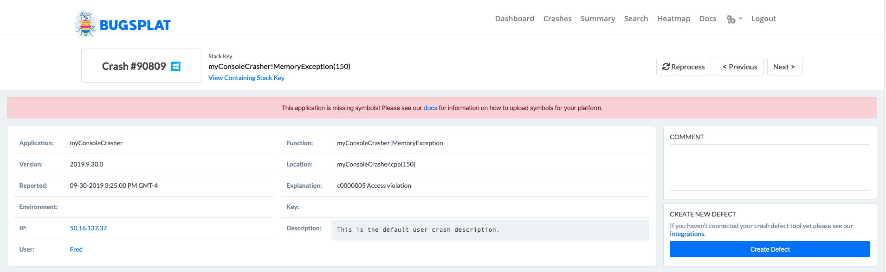
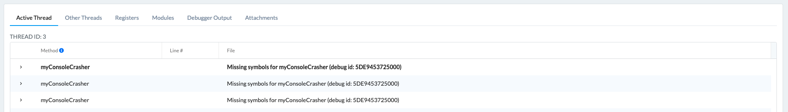
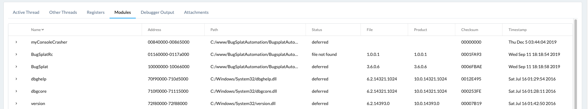

# Working with Symbol Files in Windows Environments

A common stumbling block for new BugSplat users is properly uploading symbols for Windows (native and .NET). [Symbols](../../../education/bugsplat-terminology.md#symbols) are files that contain information to map the data in a crash file to file names and line numbers in source code.

To make this issue easier, we’ve added a way to check whether symbols have been uploaded properly.

## How it works: 

At the top of the Crash page, you will see a warning if you're missing symbols.

Once the data is obtained, the fields of Function, Location, Code, OS, and Explanation will be populated with all available information. If a crash is missing symbols, there will be various messages under the 'File' column in the 'Active Thread' tab indicating which symbols were missing. Make sure to upload the missing symbols (`.exe`,`.pdb`, and `.dll` files as indicated by the 'Active Thread' tab) to the symbol store for your application name and version via the [Versions](https://app.bugsplat.com/v2/versions) page or [symbol-upload](../../../education/faq/how-to-upload-symbol-files-with-symbol-upload.md).

Additionally, you can click the 'Modules' tab to view information about all modules that were loaded on the system at crash time. In the modules table, you’ll be able to view if symbols have been properly uploaded for each module by looking at the value under the 'Status' column.

The values under the status column are as follows:

* **deferred**: the debugger doesn’t need the module’s exe, dll, or pdb files to unwind the stack.
* **file not found**: the debugger needs the module’s exe, dll, or pdb files to unwind the stack, but the exe/dll with matching debug signature cannot be located.
* **symbols not found**: the debugger needs the module’s exe, dll, or pdb files to unwind the stack and the matching exe/dll has been located, but not the symbols.
* **pdb symbols**: debugger needs the module’s exe, dll, or pdb files to unwind the stack and they have been loaded successfully.

Unfortunately, Microsoft doesn’t provide symbol information for all operating system modules, so “file not found” errors are fairly common.

The presence of a call stack warning that reads, “Stack unwind information not available. Following frames may be wrong,” indicates that the debugger lacked access to the files it needed.
