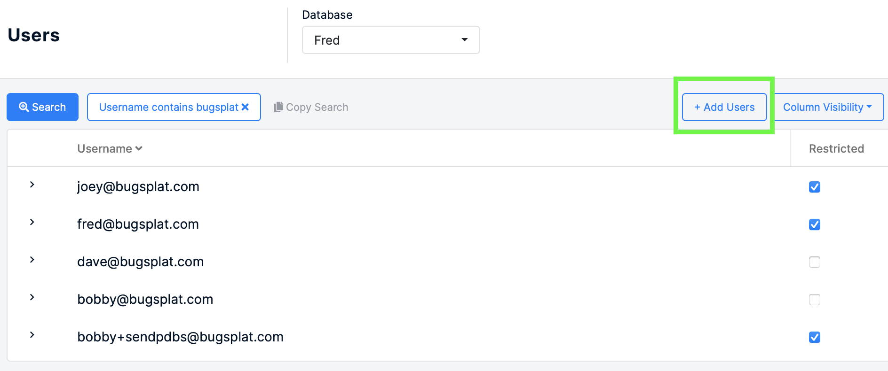

# Inviting Team Members

After signing up for a BugSplat account, it’s important to add your team members to your company so that they can access the team's crash data. Crash reporting is better with friends.

## Add Team Members to all Company Databases 🏀

To add a team member to all your company's databases, simply add them via the [Company](https://app.bugsplat.com/v2/company) page. They will receive an email providing a prompt about setting up their account.

## Adding Team Members to a Specific Databases ⚽

Only need to add a team member to a specific subset of databases? Navigate to the [Manage Users](https://app.bugsplat.com/v2/company/users) page in Settings and select the desired database from the dropdown selector.

Once you've selected the right database, click the `Add User` button. This will prompt you to insert an email address of your team member. Once invited, they will receive an email allowing them to set up their account.

Repeat this process for all desired databases.

## Requesting Access to Team Databases 🗣️

If your team or company already has an account with BugSplat, you can request access from your team member.

BugSplat has a tool that allows you to [Request Access](https://app.bugsplat.com/v2/sign-up/team-access/) to join an account from a team member who already has access to your team's account.

Note that, for security reasons, there will be no warning if the email you send to a team member isn't received. If you do not receive an email granting you access that you double-check to make sure you submitted the right email and try again.


**Managing User Permissions**: Looking for a doc about limiting a team member's permissions inside of a BugSplat account? Click [here](../../administration/introduction/user-permissions.md).

