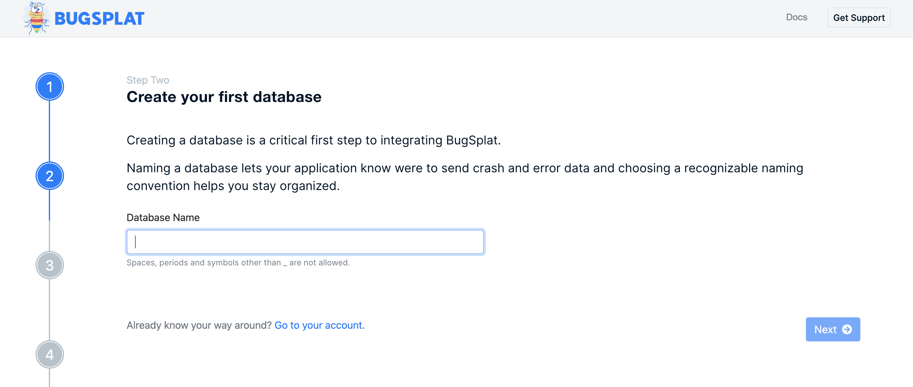
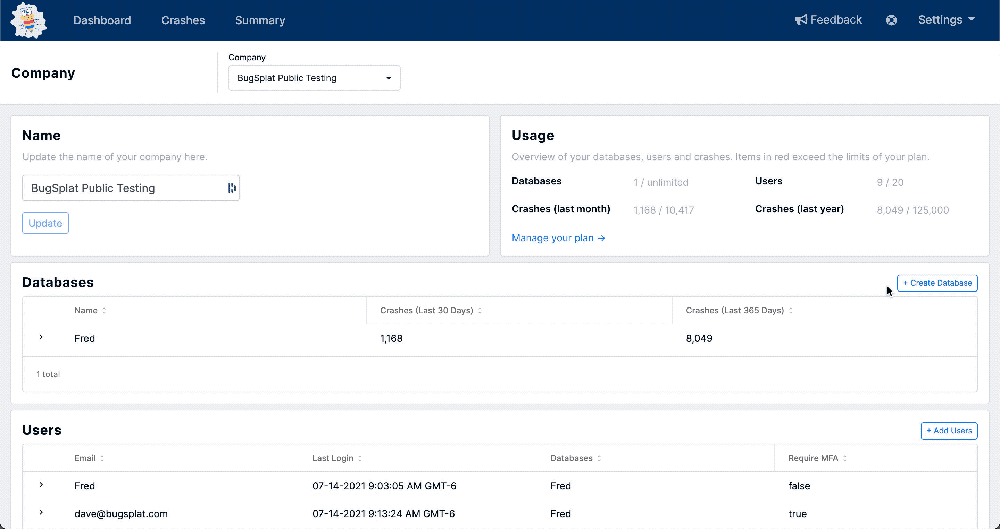

# Creating a Database

In BugSplat, crashes are organized at the highest level into databases. Generally, a database holds all crashes or errors from a single application. To learn more about the hierarchy of BugSplat information, please view this [document](../development/using-the-app.md#navigating-with-breadcrumbs).

To start using BugSplat, you'll need to create a database. You can create a database through one of two methods.

### Creating database via the onboarding tool  🔼

For new BugSplat users, creating a new database can be accomplished via the onboarding process. After creating a new account, users will be prompted to create a database.

### Creating a database through the app ➡️

Alternatively, a database can be created on the [Manage Database](https://app.bugsplat.com/v2/company/databases) page in Settings by clicking the button labeled `+ Create Database`.  This method is also useful when wishing to set up multiple databases under an account.

### Naming your database 💻

When choosing a database name, you should pick something that is descriptive and easy to remember. Please note that spaces, periods, and symbols other than \_ are not allowed. Some examples of database names are: `DeliciousDonutsApp` or `Super_Strong_Coffee_App`.
