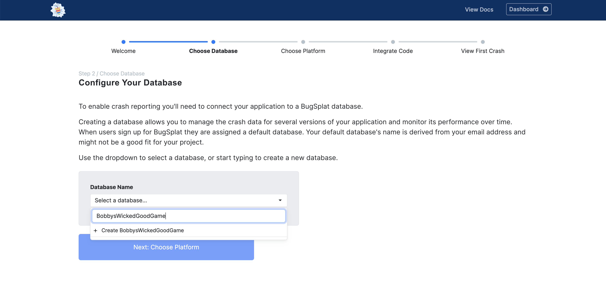
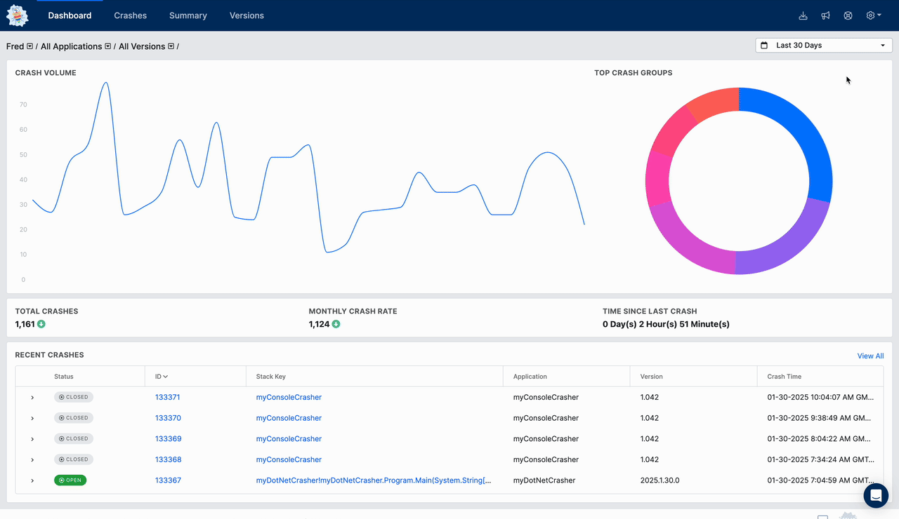

# Creating a Database

In BugSplat, a database is the top-level container for crashes and can be considered a standalone workspace for your application. Generally, a database holds all crashes and errors from a single application or logical group of applications, such as a client and server. To learn more about the hierarchy of BugSplat information, please view this [document](../development/using-the-app.md#navigating-with-breadcrumbs).

To start using BugSplat, you'll need to create a database. You can create a database through one of two methods: via the [Onboarding Tool](https://app.bugsplat.com/v2/welcome) or the [Databases page](https://app.bugsplat.com/v2/database/general).

### Create a Database via the Onboarding Tool 🧑‍🏫

For new BugSplat users, creating a new database can be accomplished via the Onboarding process. After creating a new account, users will be prompted to create a database. You can return to the Onboarding process any time by clicking the bug in the top left corner.

<figure><figcaption>
Create a Database via the Onboarding Tool
</figcaption></figure>

### Create a Database via the Database Page ⚙️

Alternatively, a database can be created on the [Databases](https://app.bugsplat.com/v2/database/general) page. At the top of the page, enter your new database's name under the **New Database** section and click **Create**. The Database's page is helpful when setting up multiple databases under an account.

<figure><figcaption>
Create a Database via the Databases Page
</figcaption></figure>

### Naming your Database 🪪

Pick something descriptive and easy to remember when choosing a database name. Please note that spaces, periods, and symbols other than `-` are prohibited. Some examples of database names are: `DeliciousDonutsApp` or `Super-Strong-Coffee-App`.
