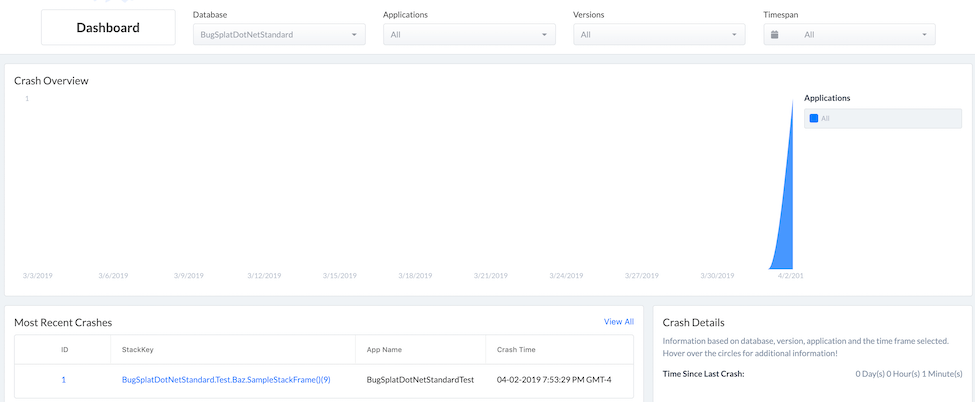
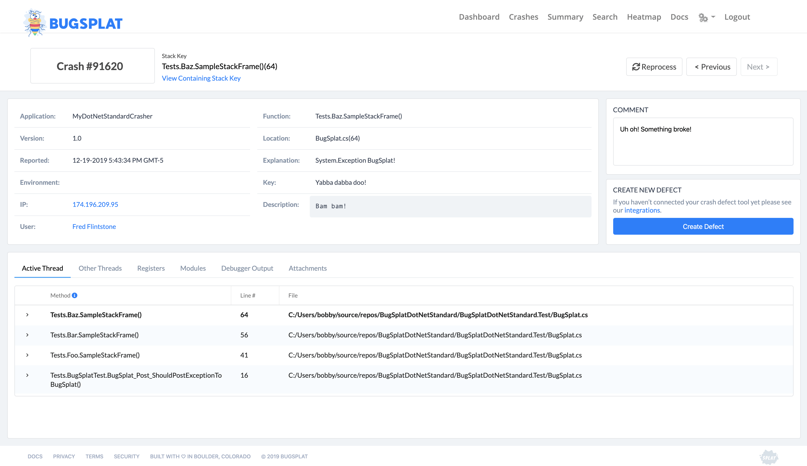

# .NET Standard

## Overview

BugSplatDotNetStandard allows you to capture and track exceptions on all .NET Standard 2.0 [platforms](https://docs.microsoft.com/en-us/dotnet/standard/net-standard). This includes:

* .NET Core
* Universal Windows Platform (UWP)
* Xamarin
* Mono

## Configuration

Install the [BugSplatDotNetStandard](https://www.nuget.org/packages/BugSplatDotNetStandard/). NuGet package.

```bash
Install-Package BugSplatDotNetStandard
```

After you've installed the NuGet package, add a using statement for the `BugSplatDotNetStandard` namespace.

```csharp
using BugSplatDotNetStandard;
```

Create a new instance of `BugSplat` providing it your database, application, and version. It's best to do this at the entry point of your application. Several defaults can be provided to BugSplat. You can provide default values for things such as description, email, key, user and file attachments.

```csharp
var bugsplat = new BugSplat(database, application, version);
bugsplat.Attachments.Add(new FileInfo("/path/to/attachment.txt"));
bugsplat.Description = "the default description";
bugsplat.Email = "fred@bugsplat.com";
bugsplat.Key = "the key!";
bugsplat.User = "Fred";
```

The `Post` method can be used to send Exception objects to BugSplat.

```csharp
try
{
    throw new Exception("BugSplat rocks!");
}
catch(Exception ex)
{
    await bugsplat.Post(exception);
}
```

Additionally, `Post` can be used to upload minidumps to BugSplat.

```csharp
await bugsplat.Post(new FileInfo("/path/to/minidump.dmp"));
```

The default values for description, email, key, and user can be overridden in the call to Post. Additional attachments can also be specified in the call to Post. Please note that the total size of the Post body and all attachments is limited to 20MB by default.

```csharp
var options = new ExceptionPostOptions()
{
    Description = "BugSplat rocks!",
    Email = "fred@bugsplat.com",
    User = "Fred",
    Key = "the key!"
};
options.AdditionalAttachments.Add(new FileInfo("/path/to/attachment2.txt"));

await bugsplat.Post(ex, options);
```

Once you've generated an error, navigate to the BugSplat [Dashboard](https://app.bugsplat.com/v2/dashboard) and ensure you have to correct database selected in the dropdown menu. You should see a new crash report under the **Recent Crashes** section:



Click the link in the **ID** column to see details about the crash:



That’s it! Your application is now configured to post crash reports to BugSplat.

If you have any additional questions please reach out to our [support](mailto:support@bugsplat.com) team
