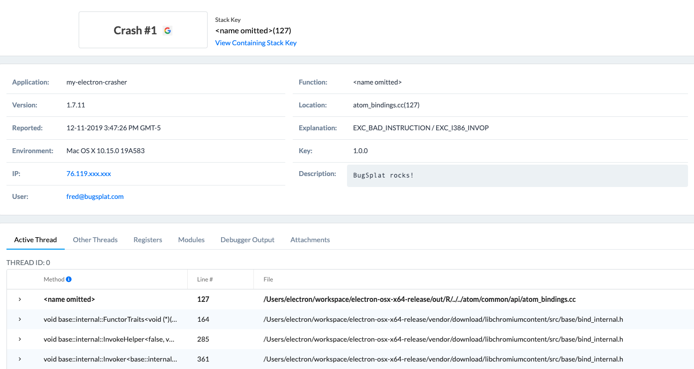
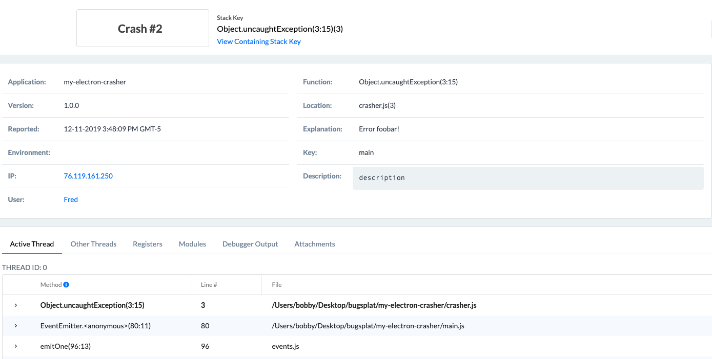

# Electron

## Overview

BugSplat supports the collection of both [electron.crashReporter](https://www.electronjs.org/docs/api/crash-reporter) (native) and [node.js](node.js.md) crash reports. Native crashes are generated via [Crashpad](https://github.com/chromium/crashpad) and BugSplat requires symbol files in order to calculate the call stack.

BugSplat will automatically resolve Electron framework symbol files when calculating call stacks. However if your application includes native add-ons or is packaged with [electron-builder](https://github.com/electron-userland/electron-builder) you will need to upload application-specific symbol files in order to see full native call stacks. All symbol files must be uploaded to BugSplat via [symupload](https://github.com/google/breakpad/blob/master/docs/getting\_started\_with\_breakpad.md#build-process-specificssymbol-generation). More information about uploading symbol files to BugSplat can be found [here](crashpad/how-to-build-google-crashpad.md#uploading-symbols).

BugSplat-node can also be used to collect [uncaughtException](https://nodejs.org/api/process.html#process\_event\_uncaughtexception) and [unhandledRejection](https://nodejs.org/api/process.html#process\_event\_unhandledrejection) events in your application's JavaScript code.

## Native

Configure [electron.crashReporter](https://github.com/electron/electron/blob/master/docs/api/crash-reporter.md) to upload crash reports to BugSplat using the following steps. Electron and Electron Framework symbol files will be automatically downloaded by BugSplat. If your application uses [Native Node Modules](https://www.electronjs.org/docs/latest/tutorial/using-native-node-modules) you will need to generate and upload symbol files in order to correctly resolve call stacks.


Please skip to step 3 if your app does not include any [Native Node Modules](https://www.electronjs.org/docs/latest/tutorial/using-native-node-modules)


#### Step 1

Add a build step to generate and upload `.sym` files for you Node Native Modules. To generate symbol files you can run [dump\_syms](crashpad/how-to-build-google-crashpad.md#generating-symbols) with a path to a `.node` file after the Node Native Module build or rebuild step if you're using a tool like [electron-rebuild](https://github.com/electron/electron-rebuild).

Once you've generated a `.sym` file for your `.node` native module, the `.sym` file can be uploaded with either [`@bugsplat/symbol-upload`](https://www.npmjs.com/package/@bugsplat/symbol-upload), [symupload](crashpad/how-to-build-google-crashpad.md#uploading-symbols), or manually via the [Versions](https://app.bugsplat.com/v2/versions?database=Fred) page.

#### Step 2

Verify that your Node Native Module `.sym` files show up on the [Versions](https://app.bugsplat.com/v2/versions) page. Be sure to upload symbols for each released version of your application. For best results, integrate [`@bugsplat/symbol-upload`](https://www.npmjs.com/package/@bugsplat/symbol-upload) or [symupload](crashpad/how-to-build-google-crashpad.md#uploading-symbols) into your build and release processes.

#### Step 3

Add a `require` or an `import` statement for `electron` and call `electron.crashReporter.start` as shown in the example below. Replace `company name`, `product name`, `database name`, `application key`, `user email`, and `comment`.

Note that the `globalExtra` fields will be sent with crashes captured on all processes:

```javascript
const electron = require('electron')
electron.crashReporter.start({
  productName: '<<product name>>',
  submitURL: 'https://<<database name>>.bugsplat.com/post/electron/crash.php',
  compress: true,
  ignoreSystemCrashHandler: true,
  rateLimit: false,
  globalExtra: {
    'key': '<<application key>>',
    'email': '<<user email>>',
    'comments': '<<comment>>'
  }
})
```

For more information on how to configure `electron.crashReporter` including adding properties to individual processes, please see the [Electron crashReporter documentation](https://www.electronjs.org/docs/latest/api/crash-reporter).

#### Step 4

Generate a crash in one of the Electron processes to test your BugSplat integration:

```typescript
process.crash()
```

#### Step 5

Navigate to the [Crashes](https://app.bugsplat.com/v2/crashes) page in BugSplat and you should see a new crash report for your application. Click the link in the Id column to see details about your crash on the [Crash](https://app.bugsplat.com/v2/crash?id=1) page:




### Processing as Windows Native

BugSplat can process Breakpad crashes reported from Windows operating systems with our Windows backend, rather than the Breakpad backend. The advantage to this approach is that BugSplat will be able to display [function arguments and local variables](https://www.bugsplat.com/blog/development/local-variables-function-arguments/) for each resolved stack frame. Another advantage of this approach is that our backend will automatically resolve Windows OS symbols.

To configure your Breakpad crashes to be processed by our Windows backend, create unique AppName/AppVersion combinations for the Windows versions of your application and upload `.pdb`, `.dll`, and `.exe` files (rather than `.sym` files). The presence of `.pdb`, `.dll`, and `.exe` files in the symbol store is what triggers the use of the Windows backend. Uploading Windows symbols can be done via the [Versions](https://app.bugsplat.com/v2/versions?database=Fred) page or our automated tool [SendPdbs](../../../../education/faq/using-sendpdbs-to-automatically-upload-symbol-files.md).

## Node.js Configuration

To configure reporting of JavaScript or TypeScript errors in your main and renderer processes please see our Node.js documentation to install and configure bugsplat-node.


[node.js.md](node.js.md)


Once you've installed bugsplat-node, create an error handler for uncaughtExceptions and unhandledPromise rejections. We recommend you quit your application in the event of an uncaughtException or unhandledPromiseRejection. You may also want to add code to display a message to your user here:

```typescript
const javaScriptErrorHandler = async (error) => {
  await bugsplat.post(error);
  app.quit();
}
```

Add the error handler created above to uncaughtException and unhandledPromiseRejection events:

```typescript
process.on('unhandledRejection', javaScriptErrorHandler)
process.on('uncaughtException', javaScriptErrorHandler)
```

Many Electron applications run multiple Node.js processes. For instance, the [electron-quick-start](https://github.com/electron/electron-quick-start) application runs both a [main](https://github.com/electron/electron-quick-start/blob/master/main.js) and a [renderer](https://github.com/electron/electron-quick-start/blob/master/renderer.js) process. You will need to require bugsplat in each process you want to capture errors. To capture errors in the renderer process, add the following to renderer.js:

Sometimes it is desirable to reload or quit the application when an error occurs in the renderer process. The following is an example of how to invoke the main process from the renderer and quit your application in the case of an unhandled exception in the renderer:

[renderer.ts](https://github.com/BugSplat-Git/my-electron-crasher/blob/master/src/renderer.ts)

```typescript
window.onerror = async (messageOrEvent, source, lineno, colno, error) => {
await bugsplat.post(error)
  ipcRenderer.send('rendererCrash')
}
```

[main.ts](https://github.com/BugSplat-Git/my-electron-crasher/blob/master/src/main.ts)

```typescript
import { ipcMain } from "electron";
ipcMain.on('rendererCrash', function () {
  // Display an error and reload or quit the app here
})
```

Test BugSplat by throwing a new error in either the main or renderer process:

```typescript
throw new Error("BugSplat!");
```

Navigate to the [Crashes](https://app.bugsplat.com/v2/crashes) page in BugSplat and you should see a new crash report for the application you just configured. Click the link in the ID column to see details about your crash on the [Crash](https://app.bugsplat.com/v2/crash?id=1) page:




That’s it! Your Electron application is now configured to post crash reports to BugSplat.

### Node.js API

In addition to the configuration demonstrated above, there are a few public methods that can be used to customize your BugSplat integration:

```typescript
bugsplat.setDefaultAppKey(appKey); // Additional metadata that can be queried via BugSplat's web application
bugsplat.setDefaultUser(user); // The name or id of your user
bugsplat.setDefaultEmail(email); // The email of your user 
bugsplat.setDefaultDescription(description); // A description placeholder that can be overridden at crash time
bugsplat.setDefaultAdditionalFilePaths([paths]); // Paths to files to be sent to BugSplat at post time (limit 1MB) 
bugsplat.postAndExit(error, options); // Wrapper for post that calls process.exit(1) after posting error to BugSplat
bugsplat.post(error, options); // Aysnc function that posts an arbitrary Error object to BugSplat
// If the values options.appKey, options.user, options.email, options.description, options.additionalFilePaths are set the corresponding default values will be overwritten
// Returns a promise that resolves with properties: error (if there was an error posting to BugSplat), response (the response from the BugSplat crash post API), and original (the error passed by bugsplat.post)
```

### Source Maps

BugSplat has the ability to map uglified and minified JavaScript function names, file names, and line numbers back to their original values via source maps. For information on how to configure your application to upload source maps to BugSplat, please see the link below.


[source-maps.md](../../../development/working-with-symbol-files/source-maps.md)


## Contributing

BugSplat loves open source software! If you have suggestions on how we can improve this integration, please reach out to support@bugsplat.com, create an [issue](https://github.com/BugSplat-Git/bugsplat-node/issues) in our [GitHub repo](https://github.com/BugSplat-Git/bugsplat-node) or send us a [pull request](https://github.com/BugSplat-Git/bugsplat-node/pulls).
