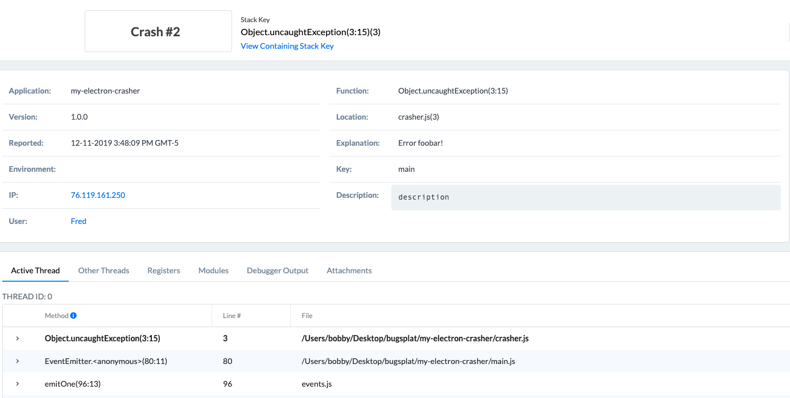

# Node.js

## Introduction

BugSplat's [bugsplat-node](https://www.npmjs.com/package/bugsplat-node) package provides error reporting for Node.js and Electron applications. Before integrating your application with BugSplat, make sure to review the [Getting Started](https://www.bugsplat.com/resources/bugsplat-101/) resources and complete the simple startup tasks listed below.

* [Sign up](https://app.bugsplat.com/v2/sign-up) for a BugSplat account
* [Log in](https://app.bugsplat.com/auth0/login) using your email address
* Create a new [database](https://app.bugsplat.com/v2/company) for your application


Need any further help? Check out the full BugSplat documentation [here](../../../../), or email the team at [support@bugsplat.com](mailto:support@bugsplat.com).


## Configuration

To add the bugsplat package to your application, run the following shell command at the root of your project’s directory:

```bash
npm i bugsplat-node --save
```

Require bugsplat at the entry point of your application \(usually main.js\) by adding the following code snippet:

```typescript
const BugSplat = require('bugsplat-node');
```

Create a new instance of the BugSplat class being sure to replace the database, application, and version with the correct values for your application:

```typescript
const bugsplat = new BugSplat(database, application, version);
```

Set the bugsplat.post function as an event handler for uncaught exceptions:

```typescript
process.on('uncaughtException', async (error) => await bugsplat.postAndExit(error));
```

You will also want to listen for unhandled promise rejections. Please note that this will only work for native promises:

```typescript
process.on('unhandledRejection', async (error) => await bugsplat.postAndExit(error))
```

Throw an exception after the event handler has been added:

```typescript
throw new Error('BugSplat!');
```

You can also use bugsplat-node to post errors from non-fatal promise rejections and errors that originate inside of try-catch blocks:

```typescript
Promise.reject(new Error('BugSplat!')).catch(async (error) => await bugsplat.post(error, options));
```

```typescript
try {
  throw new Error('BugSplat!');
} catch (error) {
  await bugsplat.post(error, options));
}
```

After posting an error with bugsplat-node, navigate to the [Crashes](https://app.bugsplat.com/v2/crashes) page in BugSplat and you should see a new crash report for the application you just configured. Click the link in the ID column to see details about your crash on the Crash page:




That’s it! Your application is now configured to post crash reports to BugSplat.

### Source Maps

BugSplat has the ability to map uglified and minified JavaScript function names, file names, and line numbers back to their original values via source maps. For information on how to configure your application to upload source maps to BugSplat, please see the link below.



### API

In addition to the configuration demonstrated above, there are a few public methods that can be used to customize your BugSplat integration:

```typescript
bugsplat.setDefaultAppKey(appKey); // Additional metadata that can be queried via BugSplat's web application
bugsplat.setDefaultUser(user); // The name or id of your user
bugsplat.setDefaultEmail(email); // The email of your user 
bugsplat.setDefaultDescription(description); // A description placeholder that can be overridden at crash time
bugsplat.setDefaultAdditionalFilePaths([paths]); // Paths to files to be sent to BugSplat at post time (limit 1MB) 
bugsplat.postAndExit(error, options); // Wrapper for post that calls process.exit(1) after posting error to BugSplat
bugsplat.post(error, options); // Aysnc function that posts an arbitrary Error object to BugSplat
// If the values options.appKey, options.user, options.email, options.description, options.additionalFilePaths are set the corresponding default values will be overwritten
// Returns a promise that resolves with properties: error (if there was an error posting to BugSplat), response (the response from the BugSplat crash post API), and original (the error passed by bugsplat.post)
view rawbugsplat-node-api.js hosted with ❤ by GitHub
```

### Additional Considerations

It is recommended that you exit and restart your application after an uncaughtException or unhandledRejection occurs. Packages such as [pm2](https://www.npmjs.com/package/pm2) and [forever](https://www.npmjs.com/package/forever) can be configured to restart your application.

Additionally you can use [domains](https://nodejs.org/api/domain.html#domain_warning_don_t_ignore_errors) to handle errors differently across various parts of your application. Domains are pending deprecation according the the Node.js [documentation](https://nodejs.org/api/domain.html), however a suitable replacement has not been added yet.

More information regarding domain deprecation can be found [here](https://github.com/nodejs/node/issues/10843).

## Contributing

BugSplat loves open source software! Please check out our project on [GitHub](https://github.com/BugSplat-Git/bugsplat-node) and send us a pull request.

