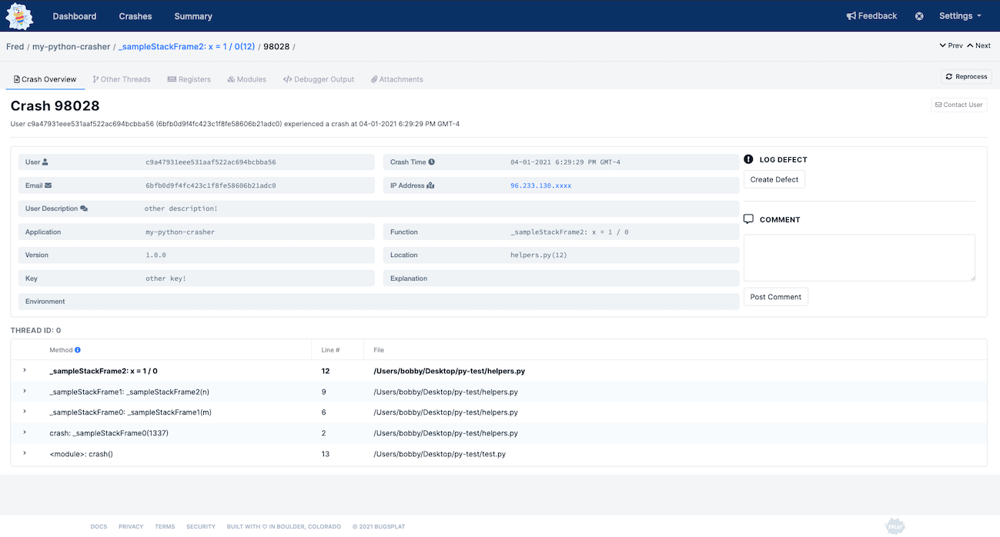

# Python

## bugsplat-py

A BugSplat integration for reporting Unhandled Exceptions in Python.

### Installing

Install the bugsplat package using pip

```bash
pip install bugsplat
```

### Usage

Import the BugSplat class

```python
from bugsplat import BugSplat
```

Create a new BugSplat instance passing it the name of your BugSplat database, application, and version

```python
bugsplat = BugSplat(database, application, version)
```

Optionally, you set default values for key, description, email, user, and additionaFilePaths

```python
bugsplat.setDefaultAppKey('key!')
bugsplat.setDefaultDescription('description!')
bugsplat.setDefaultEmail('fred@bugsplat.com')
bugsplat.setDefaultUser('Fred')
bugsplat.setDefaultAdditionalFilePaths([
    './path/to/additional-file.txt',
    './path/to/additional-file-2.txt'
])
```

Wrap your application code in a try/except block. In the except block call post. You can override any of the default properties that were set in step 3

```python
try:
    crash()
except Exception as e:
    bugsplat.post(e, additionalFilePaths=[], appKey='other key!', description='other description!', email='barney@bugsplat.com', user='Barney')
```

Once you've posted a crash, navigate to the Crashes page and click the link in the ID column to see the crash's details



Thanks for using BugSplat ❤️
