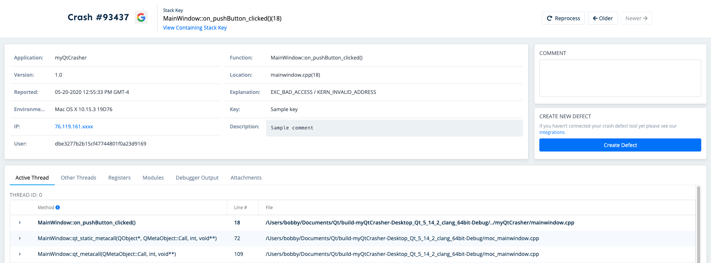

# Qt

## Introduction

Qt is a powerful cross-platform C++ app development platform. With a few easy steps, you can integrate BugSplat crash reporting in your macOS, Windows, and Linux Qt applications and leverage the most in-depth crash data on the market. Before integrating your application with BugSplat, make sure to review the [Getting Started](../../) resources and complete the simple startup tasks listed below.

* [Sign up](https://app.bugsplat.com/v2/sign-up) for a BugSplat account
* [Log in](https://app.bugsplat.com/auth0/login) using your email address
* Create a new [database](https://app.bugsplat.com/v2/company) for your application
* Review the [myQtCrasher application](https://github.com/BugSplat-Git/myQtCrasher) to see an example BugSplat integration


Need any further help? Check out the full BugSplat documentation [here](../../../../), or email the team at [support@bugsplat.com](mailto:support@bugsplat.com).


## Building Crashpad

BugSplat leverages Crashpad to provide crash reporting for macOS, Windows, and Linux Qt applications. For an in-depth guide that discusses how to build Crashpad, please see this [article](https://www.bugsplat.com/docs/sdk/crashpad/building/).

For Windows, you'll need to build shared libraries. After running `gn gen out/Default` run `gn args out/Default` and add `extra_cflags="/MD"` so that your builds produce shared libraries. Additionally, make sure the version of MSVC and the Windows SDK used to compile Crashpad is the same version used by your Qt build otherwise your project [will not build](https://stackoverflow.com/questions/62396117/integrating-crashpad-with-a-windows-qt-application). Setting the version of MSVC that builds Crashpad can be done by instead generating your configuration using the command `gn gen out/Default --winsdk="10.0.19041.0" --ide="vs2017"`.

For more info on how to build shared libraries for Windows, see this [post](https://stackoverflow.com/questions/55302553/how-to-build-dynamic-shared-libraries-of-crashpad).

## Integrating Crashpad

Once Crashpad has been built you'll need to add the relevant include directories to your project. Copy all of the Crashpad `.h` files to the directory `$$PWD/Crashpad/Include/crashpad` where `$$PWD` is your project's working directory. Add the include directories to your project by pasting the following snippet at the top of your project file:

```text
# Include directories for Crashpad libraries
INCLUDEPATH += $$PWD/Crashpad/Include/crashpad
INCLUDEPATH += $$PWD/Crashpad/Include/crashpad/third_party/mini_chromium/mini_chromium
```

Next, link your app with the Crashpad libraries. Linking with the Crashpad libraries is platform-dependent.

### **macOS**

Copy `libbase.a`, `libutil.a` and `libclient.a` into `$$PWD/Crashpad/Libraries/MacOS`. Additionally, you'll need to copy all of the `.o` files from the Crashpad build folder `/out/Default/gen/util/mach` to the directory `$$PWD/Crashpad/Libraries/MacOS/util/mach`. Finally, you'll need to link with the system libraries `libbsm`, `AppKit.Framework`, and `Security.Framework`. Add the following snippet to your project file to link with the aforementioned libraries:

```text
# Crashpad rules for MacOS
macx {
    # Crashpad libraries
    LIBS += -L$$PWD/Crashpad/Libraries/MacOS/ -lbase
    LIBS += -L$$PWD/Crashpad/Libraries/MacOS/ -lutil
    LIBS += -L$$PWD/Crashpad/Libraries/MacOS/ -lclient
    LIBS += "$$PWD/Crashpad/Libraries/MacOS/util/mach/*.o"

    # System libraries
    LIBS += -L/usr/lib/ -lbsm
    LIBS += -framework AppKit
    LIBS += -framework Security
}
```

You'll need to ship a copy of the `crashpad_handler` executable with your application. Copy `crashpad_handler` to the `$$PWD/Crashpad/Bin/MacOS` directory. Add the following snippet to the `macx` section of your project file that copies the macOS `crashpad_handler` to your project's build directory.

```text
# Crashpad rules for MacOS
macx {
    ...
    # Copy crashpad_handler to build directory
    QMAKE_POST_LINK += "mkdir -p $$OUT_PWD/crashpad"
    QMAKE_POST_LINK += "&& cp $$PWD/Crashpad/Bin/MacOS/crashpad_handler $$OUT_PWD/crashpad"
}
```

### **Windows**

Copy `base.lib`, `client.lib` and `util.lib` into `$$PWD/Crashpad/Libraries/Windows`. You'll need to link with the system library `Advapi32`. Add the following snippet to your project file to link with the aforementioned libraries:

```text
# Crashpad rules for Windows
win32 {
    # Crashpad libraries
    LIBS += -L$$PWD/Crashpad/Libraries/Windows/ -lbase
    LIBS += -L$$PWD/Crashpad/Libraries/Windows/ -lclient
    LIBS += -L$$PWD/Crashpad/Libraries/Windows/ -lutil

    # System libraries
    LIBS += -lAdvapi32
}
```

Additionally, you'll need to ship a copy of the `crashpad_handler.exe` executable with your application. Copy `crashpad_handler.exe` to the `$$PWD/Crashpad/Bin/Windows` directory. Add the following snippet to the `win32` section of your project file that copies the Windows `crashpad_handler.exe` to your project's build directory.

```text
# Crashpad rules for Windows
win32 {
    ...
    # Build variables
    CONFIG(debug, debug|release) {
        EXEDIR = $$OUT_PWD\debug
    }
    CONFIG(release, debug|release) {
        EXEDIR = $$OUT_PWD\release
    }

    # Copy crashpad_handler.exe to output directory
    QMAKE_POST_LINK += "copy /y $$shell_path($$PWD)\Crashpad\Bin\Windows\crashpad_handler.exe $$shell_path($$OUT_PWD)\crashpad"
}
```

### **Linux**

Copy `libbase.a`, `libutil.a` and `libclient.a` into `$$PWD/Crashpad/Libraries/Linux`. The order in which you specify the Crashpad libraries to link is important! `libclient.a` must be specified first, then `libutil.a` and finally `libbase.a`. Add the following snippet to your project file to link with the aforementioned libraries:

```text
# Crashpad rules for Linux
linux {
    # Crashpad libraries
    LIBS += -L$$PWD/Crashpad/Libraries/Linux/ -lclient
    LIBS += -L$$PWD/Crashpad/Libraries/Linux/ -lutil
    LIBS += -L$$PWD/Crashpad/Libraries/Linux/ -lbase
}
```

Additionally, you'll need to ship a copy of the `crashpad_handler` executable with your application. Copy `crashpad_handler` to the `$$PWD/Crashpad/Bin/MacOS` directory. Add the following snippet to the `linux` section of your project file that copies the Linux `crashpad_handler` to your project's build directory.

```text
# Crashpad rules for Linux
linux {
    ...
    # Copy crashpad_handler to build directory
    QMAKE_POST_LINK += "cp $$PWD/Crashpad/Bin/Linux/crashpad_handler $$OUT_PWD/crashpad"
}
```

## Configuring Crashpad

To enable Crashpad in your application you'll need to configure the Crashpad handler with your BugSplat database, application name, and application version. The following is a macOS, Windows, and Linux compatible snippet that will configure the Crashpad handler:

```cpp
#include <QApplication>
#include <vector>
#include "paths.h"
#include "client/crash_report_database.h"
#include "client/crashpad_client.h"
#include "client/settings.h"

using namespace base;
using namespace crashpad;

bool initializeCrashpad(QString dbName, QString appName, QString appVersion);
QString getExecutableDir(void);

bool initializeCrashpad(QString dbName, QString appName, QString appVersion)
{
    // Get directory where the exe lives so we can pass a full path to handler, reportsDir and metricsDir
    QString exeDir = getExecutableDir();

    // Helper class for cross-platform file systems
    Paths crashpadPaths(exeDir);

    // Ensure that crashpad_handler is shipped with your application
    FilePath handler(Paths::getPlatformString(crashpadPaths.getHandlerPath()));

    // Directory where reports will be saved. Important! Must be writable or crashpad_handler will crash.
    FilePath reportsDir(Paths::getPlatformString(crashpadPaths.getReportsPath()));

    // Directory where metrics will be saved. Important! Must be writable or crashpad_handler will crash.
    FilePath metricsDir(Paths::getPlatformString(crashpadPaths.getMetricsPath()));

    // Configure url with your BugSplat database
    QString url = "https://" + dbName + ".bugsplat.com/post/bp/crash/crashpad.php";

    // Metadata that will be posted to BugSplat
    QMap<string, string> annotations;
    annotations["format"] = "minidump";                 // Required: Crashpad setting to save crash as a minidump
    annotations["database"] = dbName.toStdString();     // Required: BugSplat database
    annotations["product"] = appName.toStdString();     // Required: BugSplat appName
    annotations["version"] = appVersion.toStdString();  // Required: BugSplat appVersion
    annotations["key"] = "Sample key";                  // Optional: BugSplat key field
    annotations["user"] = "fred@bugsplat.com";          // Optional: BugSplat user email
    annotations["list_annotations"] = "Sample comment";    // Optional: BugSplat crash description

    // Disable crashpad rate limiting so that all crashes have dmp files
    vector<string> arguments;
    arguments.push_back("--no-rate-limit");

    // Initialize crashpad database
    unique_ptr<CrashReportDatabase> database = CrashReportDatabase::Initialize(reportsDir);
    if (database == NULL) return false;

    // Enable automated crash uploads
    Settings *settings = database->GetSettings();
    if (settings == NULL) return false;
    settings->SetUploadsEnabled(true);

    // Attachments to be uploaded alongside the crash - default bundle size limit is 2MB
    vector<FilePath> attachments;
    FilePath attachment(Paths::getPlatformString(crashpadPaths.getAttachmentPath()));
#if defined(Q_OS_WINDOWS) || defined(Q_OS_LINUX)
    // Crashpad hasn't implemented attachments on macOS yet
    attachments.push_back(attachment);
#endif

    // Start crash handler
    CrashpadClient *client = new CrashpadClient();
    bool status = client->StartHandler(handler, reportsDir, metricsDir, url.toStdString(), annotations.toStdMap(), arguments, true, true, attachments);
    return status;
}
```

Be sure to update the values for `dbName`, `appName` and `appVersion` to values specific to your application. The `Paths` class allows you to get platform-specific paths for Crashpad and its source can be found [here](https://github.com/BugSplat-Git/myQtCrasher/blob/master/paths.cpp). To configure the paths to `crashpad_handler`, `metricsDir`, `reportsDir` and `attachment` you'll first want to find the location of your executable using the sample code below:

```cpp
#if defined(Q_OS_MACOS)
    #include <mach-o/dyld.h>
#endif

#if defined(Q_OS_LINUX)
    #include <unistd.h>
    #define MIN(x, y) (((x) < (y)) ? (x) : (y))
#endif

QString getExecutableDir() {
#if defined(Q_OS_MACOS)
    unsigned int bufferSize = 512;
    vector<char> buffer(bufferSize + 1);

    if(_NSGetExecutablePath(&buffer[0], &bufferSize))
    {
    buffer.resize(bufferSize);
    _NSGetExecutablePath(&buffer[0], &bufferSize);
    }

    char* lastForwardSlash = strrchr(&buffer[0], '/');
    if (lastForwardSlash == NULL) return NULL;
    *lastForwardSlash = 0;

    return &buffer[0];
#elif defined(Q_OS_WINDOWS)
    HMODULE hModule = GetModuleHandleW(NULL);
    WCHAR path[MAX_PATH];
    DWORD retVal = GetModuleFileNameW(hModule, path, MAX_PATH);
    if (retVal == 0) return NULL;

    wchar_t *lastBackslash = wcsrchr(path, '\\');
    if (lastBackslash == NULL) return NULL;
    *lastBackslash = 0;

    return QString::fromWCharArray(path);
#elif defined(Q_OS_LINUX)
    char pBuf[FILENAME_MAX];
    int len = sizeof(pBuf);
    int bytes = MIN(readlink("/proc/self/exe", pBuf, len), len - 1);
    if (bytes >= 0) {
        pBuf[bytes] = '\0';
    }

    char* lastForwardSlash = strrchr(&pBuf[0], '/');
    if (lastForwardSlash == NULL) return NULL;
    *lastForwardSlash = '\0';

    return QString::fromStdString(pBuf);
#else
    #error getExecutableDir not implemented on this platform
#endif
}
```

Add a call to `initializeCrashpad` at your application's entry point.

```cpp
int main(int argc, char *argv[]) {
    QString dbName = "Fred";
    QString appName = "myQtCrasher";
    QString appVersion = "1.0";
    initializeCrashpad(dbName, appName, appVersion);
}
```

### Symbols

In order to get function names and line numbers in your crash reports, you will need to generate and upload `.sym` files to BugSplat. Crashpad `.sym` files can be generated from a macOS `.dSYM` file, a Windows `.pdb` file or a Linux `.debug` file.

To generate `.dSYM`, `.pdb` and `.debug` files add the following to the project file:

```text
# Create symbols for dump_syms and symupload
CONFIG += force_debug_info
CONFIG += separate_debug_info
```

### **macOS**

To generate `.sym` files you will need to build or locate a copy of `dump_syms`. Additionally, to upload symbol files to BugSplat you will need to build or locate a copy of `symupload`. Prebuilt copies of `dump_syms` and `symupload` can be found [here](https://github.com/BugSplat-Git/myQtCrasher/tree/master/Crashpad/Tools/MacOS).

Build your project and run `dump_syms` to generate `.sym` files:

```bash
./dump_syms -g path/to/myApp.dSYM path/to/myApp > myApp.sym
```

Upload the generated `.sym` file by running `symupload`. Be sure to replace the `{{database}}`, `{{application}}` and `{{version}}` with the values you used in the Configuring Crashpad section:

```bash
./symupload "path/to/myApp.sym" "https://{{database}}.bugsplat.com/post/bp/symbol/breakpadsymbols.php?appName={{application}}&appVer={{version}}"
```

After each release build you'll need to generate and upload `.sym` files making sure to increment the version number each time. The version number from the Configuring Crashpad section must match the version number in your upload URL. An example of how to run `dump_syms` and `symupload` as a build step can be found [here](https://github.com/BugSplat-Git/myQtCrasher/blob/ddffcf99527bc1175570b7773d0489bdf5a0ba5b/myQtCrasher.pro#L62).

### **Windows**

The functionality of `dump_syms.exe` is built into `symupload.exe` on Windows. In order to generate `.sym` files, you will need to build or locate a copy of `symupload.exe`. A prebuilt copy of `symupload.exe` can be found [here](https://github.com/BugSplat-Git/myQtCrasher/tree/master/Crashpad/Tools/Windows). Additionally, in order to run `symupload.exe` a copy of `msdia140.dll` must be present in the same directory as `symupload.exe`.

Run `symupload.exe` to upload `.sym` files to BugSplat. Be sure to replace the `{{database}}`, `{{application}}` and `{{version}}` with the values you used in the Configuring Crashpad section:

```bash
symupload.exe --product {{application}} "path\to\{{application}}.exe" "https://{{database}}.bugsplat.com/post/bp/symbol/breakpadsymbols.php?appName={{application}}&appVer={{version}}"
```

You'll need to generate and upload `.sym` files making sure to increment the version number for each release build. The version number from the [Configuring Crashpad](qt.md#configuring-crashpad) section must match the version number in your upload URL. An example of how to run `dump_syms` and `symupload` as a build step can be found [here](https://github.com/BugSplat-Git/myQtCrasher/blob/ddffcf99527bc1175570b7773d0489bdf5a0ba5b/myQtCrasher.pro#L85).

### **Linux**

To generate `.sym` files you will need to build or locate a copy of `dump_syms`. Additionally, to upload symbol files to BugSplat you will need to build or locate a copy of `symupload`. Prebuilt copies of `dump_syms` and `symupload` can be found [here](https://github.com/BugSplat-Git/myQtCrasher/tree/master/Crashpad/Tools/Linux). Build your project and run `dump_syms` to generate `.sym` files:

```bash
./dump_syms path/to/myApp.debug > myApp.sym
```

Upload the generated `.sym` file by running `symupload`. Be sure to replace the `{{database}}`, `{{application}}` and `{{version}}` with the values you used in the Configuring Crashpad section:

```bash
./symupload "path/to/myApp.sym" "https://{{database}}.bugsplat.com/post/bp/symbol/breakpadsymbols.php?appName={{application}}&appVer={{version}}"
```

You'll need to generate and upload `.sym` files making sure to increment the version number for each release build. The version number from the [Configuring Crashpad](qt.md#configuring-crashpad) section must match the version number in your upload URL. An example of how to run `dump_syms` and `symupload` as a build step can be found [here](https://github.com/BugSplat-Git/myQtCrasher/blob/ddffcf99527bc1175570b7773d0489bdf5a0ba5b/myQtCrasher.pro#L98).

## Generating a Crash Report

Force a crash in your application after Crashpad has been initialized:

```cpp
*(volatile int *)0 = 0;
```

After you've submitted a crash report, navigate to the [Dashboard](https://app.bugsplat.com/v2/dashboard) page. Click the link in the `ID` column to see the details of your crash report. The following image is from our sample `myQtCrasher` application:



