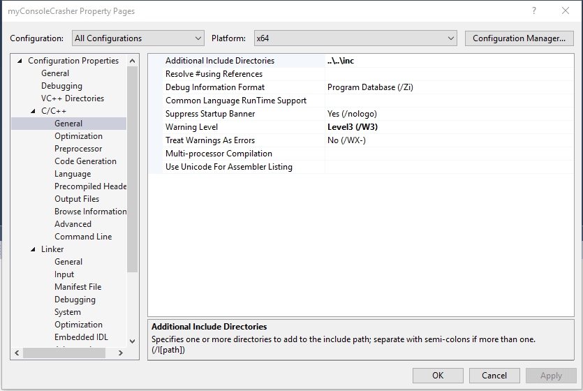
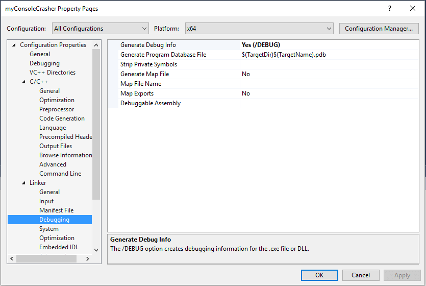
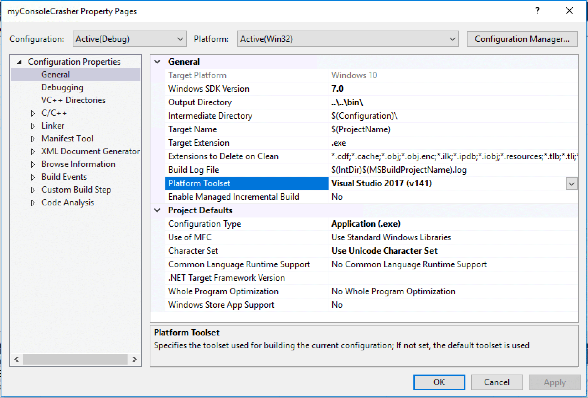
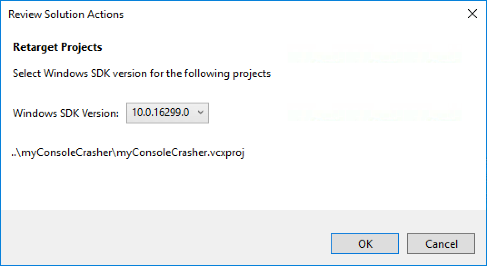

# BugSplat Crash Reporting Library for Windows (Native C++)

## Overview

This document explains how your Microsoft Visual C++ application can be modified to provide full debug information to the BugSplat web application when it crashes.

### First steps

To begin [Download](https://app.bugsplat.com/browse/download\_item.php?item=native) and unzip the BugSplat software development kit for Microsoft Visual C++.

To get a feel for the BugSplat service before enabling your application, feel free to experiment with the [myConsoleCrasher sample application](../../../posting-a-test-crash/myconsolecrasher-c-plus-plus/). You can find the Visual Studio project file located in your download folder at `...\BugSplatNative\BugSplat\samples\myConsoleCrasher\myConsoleCrasher.vcxproj`.

Run the sample application without the debugger attached to post a sample crash report to our [public database](../../../../../education/faq/using-bugsplats-public-database.md).

You may also want to browse the [BugSplat Native API](https://www.bugsplat.com/platforms/cpp/api/) documentation.

### Generating crash reports with your application

Add BugSplat to your application using the following steps:

* Include **`BugSplat.h`**.
* Create an instance of MiniDmpSender following the example in myConsoleCrasher. The MiniDmpSender constructor requires three parameters: BugSplat database, application name and version. The BugSplat database is created and selected on the Databases page. Typically, you will create a new database for each major release of your product. You supply application name and version to match your product release. These same values must be used when uploading symbol files for your application.
* Link your application to **`BugSplat.lib`**.
* Add **`BsSndRpt.exe`**, **`BugSplat.dll`**, and **`BugSplatRC.dll`** to your application's installer.

You should modify your build settings so that symbol files are created for release builds, e.g.,

**Note:** To get fully detailed call stacks and variable names for each crash on the BugSplat website, every time you build a release version of your application for distribution or internal testing, you should upload all **`.exe`**, **`.dll`**, and **`.pdb`** files for your product on the [Symbols Page](https://app.bugsplat.com/v2/symbols/). Better yet, use the [SendPdbs](../../../../../education/faq/using-sendpdbs-to-automatically-upload-symbol-files.md) application as part of your build process to automate symbol upload to BugSplat.

Test your application by forcing a crash and verifying that the BugSplat dialog appears and that crashes are posted to your BugSplat account.

**Finally**, make sure to check that symbol names in the call stack are resolved correctly. If they aren’t, double-check that the correct version of symbol files and all executables for your application have been uploaded on the [Symbols](https://app.bugsplat.com/v2/symbols/) page.

## Toolset Considerations

MyConsoleCrasher targets the v120\_xp toolset which is not installed by later versions of Visual Studio. To build MyConsoleCrasher you may need to update the project's toolset and platform version.

The following steps are for Visual Studio 2017, other versions of Visual Studio may require slightly different steps.

To update your project's toolset and platform version, right click your project in Visual Studio, then choose Properties. In the properties menu, change "Platform Toolset" to a version available in your environment and click OK to save your changes.

Close the properties menu and right click the project again. This time choose the option to "Retarget Projects". Choose Windows SDK Version 10.\* and click OK. You should now be able to build MyConsoleCrasher.

## Further options

Instructions for modifying the default crash dialog can be found on the [Windows Dialog Box ](../../../../../education/how-tos/customize-the-crash-dialog.md)page.

## Dependencies

See technology dependencies at our [dependencies page](dependencies.md).
