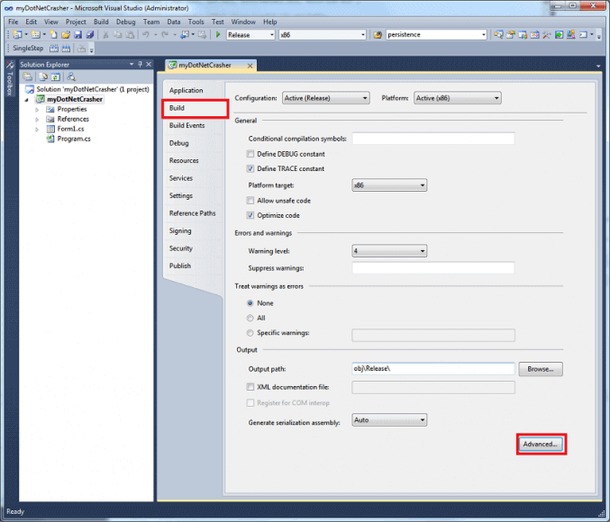
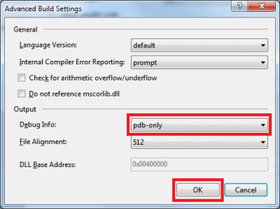

# .NET Framework (Deprecated)


BugSplat's .NET Framework SDK is deprecated. We have a new cross-platform .NET SDK available for early-access testing. If you're interested in using our latest SDK, please email [support@bugsplat.com](mailto:support@bugsplat.com).


## Overview

The BugSplat .NET SDK supports applications written using the [Microsoft Common Language Runtime (CLR)](https://docs.microsoft.com/en-us/dotnet/standard/clr). This includes applications written using C#. The managed call stacks captured at the time of a crash include function names, source code file names, and line numbers. In addition, BugSplat will display mixed-mode call stacks that include both managed and native code.

To get started, make sure to [log in](https://app.bugsplat.com/cognito/login) using your email address and [download](https://app.bugsplat.com/browse/download_item.php?item=dotnet) the BugSplat software development kit for .NET Framework / C# applications.

To get a feel for the BugSplat service before enabling your application, feel free to experiment with the myDotNetCrasher sample application, which is part of the BugSplat software development kit.

Instructions for modifying the default crash dialog are on the [Windows Dialog Box](../../../../education/how-tos/customize-the-crash-dialog.md) page.

## Integration

In a few simple steps, your .NET application can be modified to provide full debug information on the BugSplat website when it crashes.

1. Add a reference to "BugSplatDotNet.dll".
2. Add a call to BugSplat.CrashReporter.Init and add the BugSplat exception handlers for the appropriate set of system exceptions. As shown in the myDotNetCrasher sample app, this takes just a few lines of code.
   * The initialization call requires three parameters: BugSplat database, application name, and version. You supply the application name and version.
   * The BugSplat database is created on the [Manage Database](https://app.bugsplat.com/v2/company/databases) page in Settings. Typically, you will create a new database for each major release of your product.
3. Add `BsSndRpt.exe`, `BugSplatDotNet.dll`, and `BugSplatRc.dll` to your application's installer.
4. Edit `BugSplatRc.dll` with Visual Studio if you wish to change the banner displayed when your application crashes.
5. Add symbolic debug information to your release build. **Important!** To get symbolic stack reports, debug information ([pdb, dll, and executable files](../../../../education/faq/using-sendpdbs-to-automatically-upload-symbol-files.md)) needs to be uploaded to the BugSplat website along with your application’s executable files. Modify your build settings so that symbol files are created for Release builds, e.g.,


After each build you should upload the new executable and files. The [myDotNetCrasher sample app](windows-dot-net-framework.md) uses a Visual Studio post build event to automate this step.



Visual Studio debugger's hosting process can interfere with BugSplat's ability to resolve symbols; it should be disabled in your project's debug settings when submitting crash reports that occur while debugging.


6\. Test your application by forcing a crash, and then verify that crashes are posted and symbol names are resolved. You can verify symbols have been posted on the [Versions](https://app.bugsplat.com/v2/versions) page. You can view a list of crashes that have been posted to BugSplat on the [Crashes](https://app.bugsplat.com/v2/crashes) page
