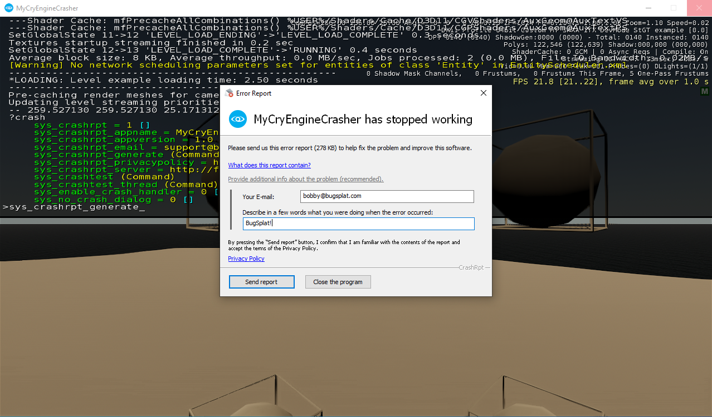
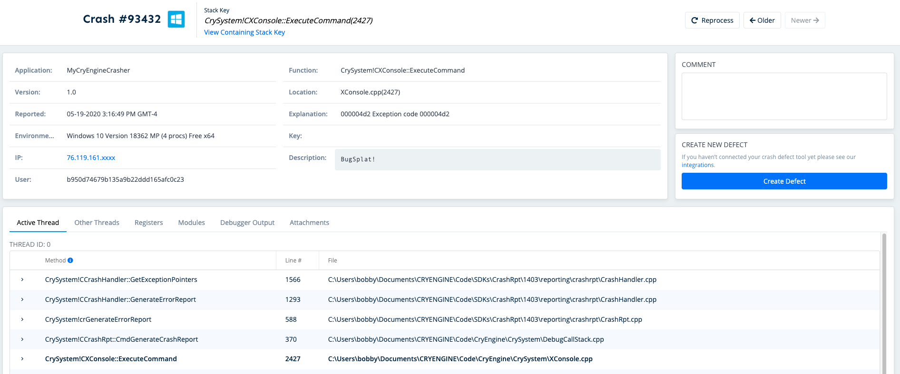

# CRYENGINE

## Introduction

Enable BugSplat crash reporting in your CRYENGINE game with a few easy steps and leverage the most in-depth crash data on the market. Before integrating your application with BugSplat, make sure to review the [Getting Started](../../) resources and complete the simple startup tasks listed below.

* [Sign up](https://app.bugsplat.com/v2/sign-up) for a BugSplat account
* [Log in](https://app.bugsplat.com/auth0/login) using your email address
* Create a new [database](https://app.bugsplat.com/v2/company) for your application


Need any further help? Check out the full BugSplat documentation [here](../../../../), or email the team at [support@bugsplat.com](mailto:support@bugsplat.com).


## Building CRYENGINE

In order to get function names and line numbers for internal CRYENGINE code you'll need to build CRYENGINE from source and generate `.pdb` files. Make sure to build the engine with the `Profile` configuration so that `.pdb` files are generated. The following video gives an overview of how to clone and build the CRYENGINE [source](https://github.com/CRYTEK/CRYENGINE):

Next, upload all of the `.pdb`, `.dll` and `.exe` files in the `bin` folder using [SendPdbs](../../../../education/faq/using-sendpdbs-to-automatically-upload-symbol-files.md). Make sure to note the application name, version and database as you'll need these values later.

### Project Configuration

In order to point the CRYENGINE crash reporter at BugSplat you'll need to make a few modifications to the `.cryproject` file for your project. Open the `.cryproject` file in a text editor and add the following snippet of JSON:

```javascript
{
    ...
    "console_variables": {
        "sys_crashrpt": "1",
        "sys_crashrpt_appname": "{{application}}",
        "sys_crashrpt_appversion": "{{version}}",
        "sys_crashrpt_email": "support@bugsplat.com",
        "sys_crashrpt_privacypolicy": "https://bugsplat.com/privacy",
        "sys_crashrpt_server": "http://{{database}}.bugsplat.com/post/cryengine/index.php",
        "sys_target_platforms": "pc,ps4,xboxone,linux"
    },
    ...
}
```

Make sure to replace `{{application}}`, `{{version}}`, and `{{database}}` with values specific to your game. Note these values must match the values you used when you uploaded symbols for CRYENGINE.

### Building Your Game

By default building your game should output `.pdb` files so that minidumps can be debugged by a remote machine. If your build does not output `.pdb` files you will need to change the [MSVC flags](https://github.com/CRYTEK/CRYENGINE/blob/release/Tools/CMake/CRYENGINE-MSVC.cmake) with `CMAKE` and regenerate the solution.

### Uploading Symbols

Symbol files are required in order to display function names, file names and line numbers of source code in crash reports. Once you've built your project's solution upload the resulting files in `bin` using [SendPdbs](../../../../education/faq/using-sendpdbs-to-automatically-upload-symbol-files.md).

### Generating a Crash Report

Right click the `.cryproject` file for your game and select `Launch Game`. Once the game has launched press the `` ` (backtick) `` key on your keyboard to display the console. Type `?crash` to ensure that all of the variables from the `Project Configuration` step have been loaded by your game. To generate a crash report, enter `sys_crashrpt_generate` into the console:



### Viewing the Crash Report

After you've submitted a crash report, navigate to the [Dashboard](https://app.bugsplat.com/v2/dashboard) page. Click the link in the `ID` column to see the details of your crash report. In this case the last 4 stack frames are all related to the crash report generator and the frame of interest is the 5th frame of the call stack. Create a [subkey](../../../../education/how-tos/using-subkeying-to-find-difficult-crashes.md) by expanding the 5th row in the `Active Thread` and then click the `Create Subkey` button. Navigate back to the crash and notice that the Stack Key is now `CrySystem!CXConsole::ExecuteCommand(2427)` instead of `CrySystem!CCrashHandler::GetExceptionPointers(1566)`.


