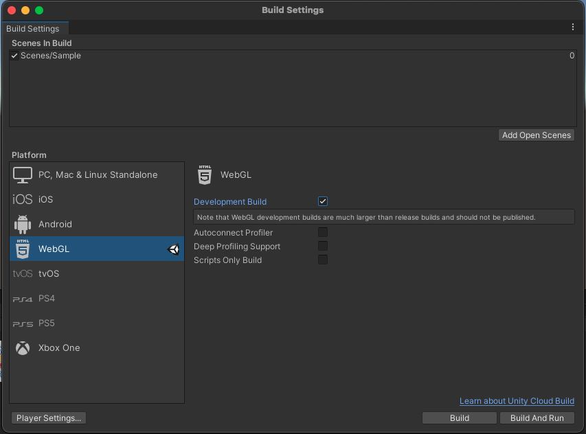
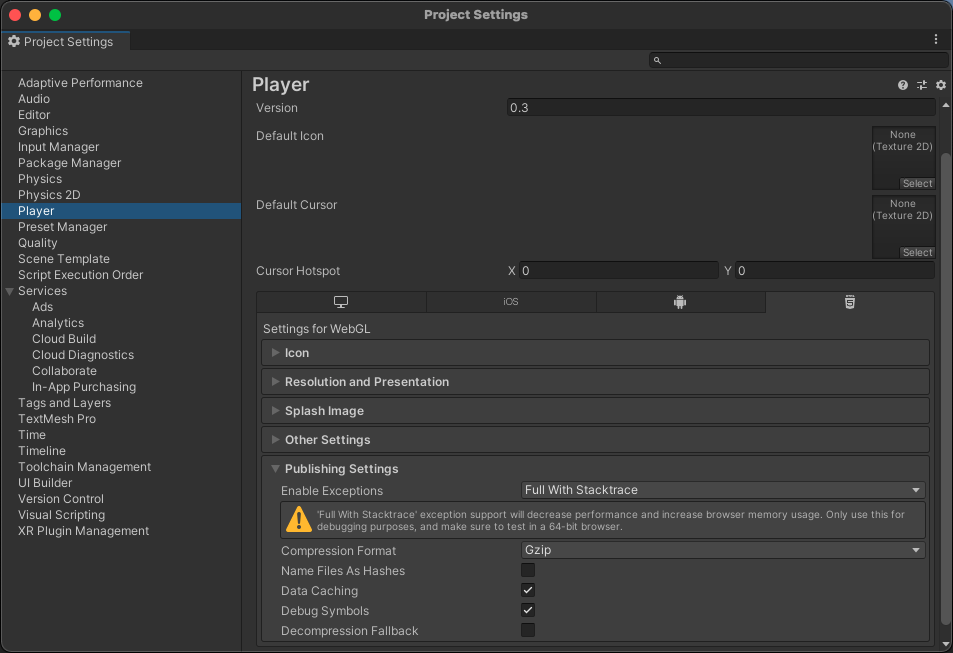

# Unity

## Overview

BugSplat's [`com.bugsplat.unity`](https://openupm.com/packages/com.bugsplat.unity/?subPage=readme) package provides crash and exception reporting for Unity projects. BugSplat provides you with invaluable insight into the issues tripping up your users. Our Unity integration collects screenshots, log files, exceptions, and Windows minidumps so that you can fix bugs and deliver a better user experience.

## Installation

BugSplat's `com.bugsplat.unity` package can be added to your project via [OpenUPM](https://openupm.com/packages/com.bugsplat.unity/?subPage=readme) or a [URL](https://github.com/BugSplat-Git/bugsplat-unity) to our git repository.

### OpenUPM

Information on how to install the [OpenUPM](https://openupm.com/) package for [Node.js](https://nodejs.org/en/) can be found [here](https://openupm.com/).

```shell
openupm add com.bugsplat.unity
```

### Git

Information on adding a Unity package via a git URL can be found [here](https://docs.unity3d.com/Manual/upm-ui-giturl.html).

## Sample

After installing `com.bugsplat.unity` you'll have the opportunity to import a sample project that's fully configured to post error reports to BugSplat. Click here if you'd like to skip the sample project and get straight to the [usage](https://openupm.com/packages/com.bugsplat.unity/?subPage=readme#usage) instructions.

To import the sample, click the carrot next to **Samples** to reveal the **my-unity-crasher** sample. Click **Import** to add the sample to your project.


In the Project Assets browser, open the **Sample** scene from `Samples > BugSplat > Version > my-unity-crasher > Scenes`.

Next, select `Samples > BugSplat > Version > my-unity-crasher` to reveal the **BugSplatOptions** object. Click BugSplatOptions and replace the value of database with your BugSplat database.


Click **Play** and click or tap one of the buttons to send an error report to BugSplat. To view the error report, navigate to the BugSplat \[Dashboard] ([https://app.bugsplat.com/v2/dashboard](https://app.bugsplat.com/v2/dashboard)) and ensure that you have the correct database selected.


## Configuration

BugSplat's Unity integration is flexible and can be used in a variety of ways. The easiest way to get started is to attach the `BugSplatManager` Monobehaviour to a GameObject.


`BugSplatManager` needs be initialized with a `BugSplatOptions` serialized object. A new instance of `BugSplatOptions` can be created through the Asset create menu.


Configure fields as appropriate. Note that if Application or Version are left empty, `BugSplat` will by default configure these values with `Application.productName` and `Application.version`, respectively.


Finally, provide a valid `BugSplatOptions` to `BugSplatManager`.


### BugSplat Manager <a href="#bugsplat-manager-settings" id="bugsplat-manager-settings"></a>

<table><thead><tr><th width="339">Setting</th><th>Description</th></tr></thead><tbody><tr><td><strong>DontDestroyManagerOnSceneLoad</strong></td><td>Should the BugSplat Manager persist through scene loads?</td></tr><tr><td><strong>RegisterLogMessageRecieved</strong></td><td>Register a callback function and allow BugSplat to capture instances of LogType.Exception.</td></tr></tbody></table>

### BugSplat Options <a href="#bugsplat-options" id="bugsplat-options"></a>

<table><thead><tr><th width="275">Option</th><th>Description</th></tr></thead><tbody><tr><td><strong>Database</strong></td><td>The name of your BugSplat database.</td></tr><tr><td><strong>Application</strong></td><td>The name of your BugSplat application. Defaults to Application.productName if no value is set.</td></tr><tr><td><strong>Version</strong></td><td>The version of your BugSplat application. Defaults to Application.version if no value is set.</td></tr><tr><td><strong>Description</strong></td><td>A default description that can be overridden by call to Post.</td></tr><tr><td><strong>Email</strong></td><td>A default email that can be overridden by call to Post.</td></tr><tr><td><strong>Key</strong></td><td>A default key that can be overridden by call to Post.</td></tr><tr><td><strong>Notes</strong></td><td>A default general purpose field that can be overridden by call to post</td></tr><tr><td><strong>User</strong></td><td>A default user that can be overridden by call to Post</td></tr><tr><td><strong>CaptureEditorLog</strong></td><td>Should BugSplat upload Editor.log when Post is called</td></tr><tr><td><strong>CapturePlayerLog</strong></td><td>Should BugSplat upload Player.log when Post is called</td></tr><tr><td><strong>CaptureScreenshots</strong></td><td>Should BugSplat a screenshot and upload it when Post is called</td></tr><tr><td><strong>PostExceptionsInEditor</strong></td><td>Should BugSplat upload exceptions when in editor</td></tr><tr><td><strong>PersistentDataFileAttachmentPaths</strong></td><td>Paths to files (relative to Application.persistentDataPath) to upload with each report</td></tr><tr><td><strong>ShouldPostException</strong></td><td>Settable guard function that is called before each BugSplat report is posted</td></tr><tr><td><strong>SymbolUploadClientId</strong></td><td>An OAuth2 Client ID value used for uploading <a href="https://docs.bugsplat.com/introduction/development/working-with-symbol-files">symbol files</a> generated via BugSplat's <a href="https://app.bugsplat.com/v2/settings/database/integrations#oauth">OAuth Integrations</a> page</td></tr><tr><td><strong>SymbolUploadClientSecret</strong></td><td>An OAuth2 Client Secret value used for uploading <a href="https://docs.bugsplat.com/introduction/development/working-with-symbol-files">symbol files</a> generated via BugSplat's <a href="https://app.bugsplat.com/v2/settings/database/integrations#oauth">OAuth Integrations</a> page</td></tr></tbody></table>

## Usage <a href="#usage" id="usage"></a>

If you're using `BugSplatOptions` and `BugSplatManager`, BugSplat automatically configures an `Application.logMessageReceived` handler that will post reports when it encounters a log message of type `Exception`. You can also extend your BugSplat integration and [customize report metadata](unity.md#adding-metadata), [report exceptions in try/catch blocks](unity.md#try-catch-reporting), [prevent repeated reports](unity.md#windows-minidumps-1), and [upload windows minidumps](unity.md#windows-minidumps) from native crashes.

#### Adding Metadata

First, find your instance of `BugSplat`. The following is an example of how to find an instance of `BugSplat` via `BugSplatManager`:

```csharp
var bugsplat = FindObjectOfType<BugSplatManager>().BugSplat;
```

You can extend `BugSplat` by setting the following properties:

```csharp
bugsplat.Attachments.Add(new FileInfo("/path/to/attachment.txt"));
bugsplat.Description = "description!";
bugsplat.Email = "fred@bugsplat.com";
bugsplat.Key = "key!";
bugsplat.Notes = "notes!";
bugsplat.User = "Fred";
bugsplat.CaptureEditorLog = true;
bugsplat.CapturePlayerLog = false;
bugsplat.CaptureScreenshots = true;
```

You can use the `Notes` field to capture arbitrary data such as system information:

```csharp
void Start()
{
    bugsplat = FindObjectOfType<BugSplatManager>().BugSplat;
    bugsplat.Notes = GetSystemInfo();
}

private string GetSystemInfo()
{
    var info = new Dictionary<string, string>();
    info.Add("OS", SystemInfo.operatingSystem);
    info.Add("CPU", SystemInfo.processorType);
    info.Add("MEMORY", $"{SystemInfo.systemMemorySize} MB");
    info.Add("GPU", SystemInfo.graphicsDeviceName);
    info.Add("GPU MEMORY", $"{SystemInfo.graphicsMemorySize} MB");

    var sections = info.Select(section => $"{section.Key}: {section.Value}");
    return string.Join(Environment.NewLine, sections);
}
```

#### Try/Catch Reporting

Exceptions can be sent to BugSplat in a try/catch block by calling `Post`.

```csharp
try
{
    throw new Exception("BugSplat rocks!");
}
catch (Exception ex)
{
    StartCoroutine(bugsplat.Post(ex));
}
```

The default values specified on the instance of `BugSplat` can be overridden in the call to `Post`. Additionally, you can provide a `callback` to `Post` that will be invoked with the result once the upload is complete.

```csharp
var options = new ReportPostOptions()
{
    Description = "a new description",
    Email = "barney@bugsplat.com",
    Key = "a new key!",
    Notes = "some new notes!",
    User = "Barney"
};

options.AdditionalAttachments.Add(new FileInfo("/path/to/additional.txt"));

static void callback()
{
    Debug.Log($"Exception post callback!");
};

StartCoroutine(bugsplat.Post(ex, options, callback));
```

#### Preventing Repeated Reports <a href="#windows-minidumps" id="windows-minidumps"></a>

By default BugSplat prevents reports from being sent at a rate greater than 1 per every 60 seconds. You can override the default crash report throttling implementation by setting `ShouldPostException` on your BugSplat instance. To override `ShouldPostException`, assign the property a new `Func<Exception, bool>` value. Be sure your new implementation can handle a null value for `Exception`!

The following example demonstrates how you could implement your own time-based report throttling mechanism:

```csharp
var lastPost = DateTime.Now;

bugsplat.ShouldPostException = (ex) =>
{
    var now = DateTime.Now;

    if (now - lastPost < TimeSpan.FromSeconds(3))
    {
        Debug.LogWarning("ShouldPostException returns false. Skipping BugSplat report...");
        return false;
    }

    Debug.Log("ShouldPostException returns true. Posting BugSplat report...");
    lastPost = now;

    return true;
};
```

#### Windows Minidumps <a href="#windows-minidumps" id="windows-minidumps"></a>

BugSplat can be configured to upload Windows minidumps created by the `UnityCrashHandler`. BugSplat will automatically pull Unity Player symbols from the [Unity Symbol Server](https://docs.unity3d.com/Manual/WindowsDebugging.html). If your game contains Native Windows C++ plugins, `.dll` and `.pdb` files in the `Assets/Plugins/x86` and `Assets/Plugins/x86_64` folders will be uploaded automatically by BugSplat's PostBuild script and used in symbolication.

To enable uploading of plugin symbols, generate a Client ID and Client Secret on the BugSplat [Integrations](https://app.bugsplat.com/v2/settings/database/integrations) page. Add your Client ID and Client Secret to the `BugSplatOptions` object you generated in the [Configuration](https://openupm.com/packages/com.bugsplat.unity/?subPage=readme#%E2%9A%99%EF%B8%8F-configuration) section. Once configured, plugins will be uploaded automatically the next time you build your project.

The methods `PostCrash`, `PostMostRecentCrash`, and `PostAllCrashes` can be used to upload minidumps to BugSplat. We recommend running `PostMostRecentCrash` when your game launches.

```csharp
StartCoroutine(bugsplat.PostCrash(new FileInfo("/path/to/crash/folder")));
StartCoroutine(bugsplat.PostMostRecentCrash());
StartCoroutine(bugsplat.PostAllCrashes());
```

Each of the methods that post crashes to BugSplat also accept a `MinidumpPostOptions` parameter and a `callback`. The usage of `MinidumpPostOptions` and `callback` are nearly identically to the `ExceptionPostOptions` example listed above.

You can generate a test crash on Windows with any of the following methods.

```csharp
Utils.ForceCrash(ForcedCrashCategory.Abort);
Utils.ForceCrash(ForcedCrashCategory.AccessViolation);
Utils.ForceCrash(ForcedCrashCategory.FatalError);
Utils.ForceCrash(ForcedCrashCategory.PureVirtualFunction);
```

Once you've posted an exception or a minidump to BugSplat click the link in the **ID** column on either the [Dashboard](https://app.bugsplat.com/v2/dashboard) or [Crashes](https://app.bugsplat.com/v2/crashes) pages to see details about your crash.

<figure><figcaption></figcaption></figure>

### UWP <a href="#uwp" id="uwp"></a>

In order to use BugSplat in a Universal Windows Platform application you will need to add some capabilities to the `Package.appxmanifest` file in the solution directory that Unity generates at build time.

#### Exceptions and Log Files <a href="#exceptions-and-log-files" id="exceptions-and-log-files"></a>

In order to report exceptions and upload log files you will need to add the `Internet (Client)` capability.

#### Windows Minidumps <a href="#windows-minidumps-1" id="windows-minidumps-1"></a>

To upload minidumps created on Windows you will need to add the `Internet (Client)` capability.

Additionally, we found there were some restricted capabilities that were required in order to generate minidumps. Please see this Microsoft [document](https://docs.microsoft.com/en-us/windows/win32/wer/collecting-user-mode-dumps) that describes how to configure your system to generate minidumps for UWP native crashes.

To upload minidumps from `%LOCALAPPDATA%\CrashDumps` you will also need to add the `broadFileSystemAccess` restricted capability. To add access to the file system you will need to add the following to your `Package.appxmanifest`:

```xml
<Package xmlns:rescap="http://schemas.microsoft.com/appx/manifest/foundation/windows10/restrictedcapabilities" ... >
```

Under the `Capabilities` section add the `broadFileSystemAccess` capability:

```xml
<Capabilities>
    <rescap:Capability Name="broadFileSystemAccess" />
</Capabilities>
```

Finally, ensure that your application has access to the file system. The following is a snippet illustrating where this is set for our [my-unity-crasher](https://github.com/BugSplat-Git/my-unity-crasher) sample:

<figure><figcaption></figcaption></figure>

### WebGL

A few settings must be changed in order to capture function names and line numbers in a WebGL exception report. Open **File > Build Settings** and switch the platform to **WebGL** and check **Development Build.**



Click the button that says **Player Settings**, highlight the **Player** section. Under **Publishing Settings**, select **Full With Stacktrace**.&#x20;



Please note that Unity does not recommend shipping development builds and thus this configuration is not recommended for applications in production.

## Contributing

BugSplat ❤️ 's open source! If you feel that this integration can be improved, please open an [Issue](https://github.com/BugSplat-Git/bugsplat-unity/issues). If you have an awesome new feature you'd like to implement, we'd love to merge your [Pull Request](https://github.com/BugSplat-Git/bugsplat-unity/pulls). You can also reach out to us via an email to [support@bugsplat.com](mailto:support@bugsplat.com) or the in-app chat on bugsplat.com.
