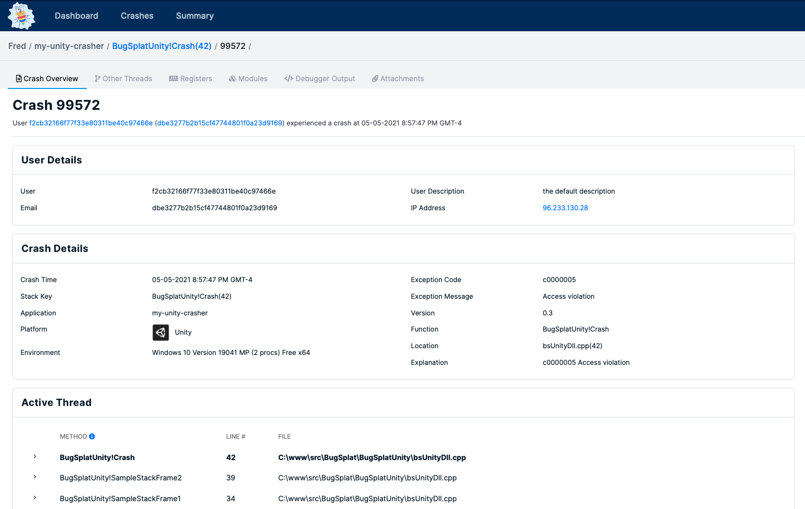

# Unity

## Introduction

BugSplat's `com.bugsplat.unity` package provides crash and exception reporting for Unity projects. BugSplat provides you with invaluable insight into the issues tripping up your users. Our Unity integration collects screenshots, log files, exceptions, and Windows minidumps so that you can fix bugs and deliver a better user experience.

Before integrating your application with BugSplat, make sure to review the [Getting Started](../../) resources and complete the simple startup tasks listed below.

* [Sign up](https://app.bugsplat.com/v2/sign-up) for a BugSplat account
* [Log in](https://app.bugsplat.com/auth0/login) using your email address
* Create a new [database](https://app.bugsplat.com/v2/company) for your application

Additionally, you can check out our [my-unity-crasher](https://github.com/BugSplat-Git/my-unity-crasher) sample that demonstrates how to use `com.bugsplat.unity`.


Need any further help? Check out the full BugSplat documentation [here](../../../../), or email the team at [support@bugsplat.com](mailto:support@bugsplat.com).


## Installation

BugSplat's `com.bugsplat.unity` package can be added to your project via [OpenUPM](https://github.com/BugSplat-Git/my-unity-crasher) or a [URL](https://github.com/BugSplat-Git/my-unity-crasher) to our git repository.

### OpenUPM

Information on how to install the OpenUPM package for node.js can be found [here](https://openupm.com/).

```text
openupm add com.bugsplat.unity
```

### Git

Information on adding a Unity package via a git URL can be found [here](https://docs.unity3d.com/Manual/upm-ui-giturl.html).

## Usage

BugSplat's Unity integration is flexible and can be used in a variety of ways. The easiest way to get started is to create new script and attach it to a GameObject. In your script, add a using statement that aliases `BugSplatUnity.BugSplat` as `BugSplat`.

```csharp
using BugSplat = BugSplatUnity.BugSplat;
```

Next, create a new instance of `BugSplat` passing it your `database`, `application`, and `version`. Use `Application.productName`, and `Application.version` for application and version respectively.

```csharp
var bugsplat = new BugSplat(database, Application.productName, Application.version);
```

You can set the defaults for a variety of properties on the `BugSplat` instance. These default values will be used in exception and crash posts. Additionally, you can tell BugSplat to capture a screenshot, include the Player.log file, and include the `Editor.log` file when an exception is recorded.

```csharp
bugsplat.Attachments.Add(new FileInfo("/path/to/attachment.txt"));
bugsplat.Description = "description!";
bugsplat.Email = "fred@bugsplat.com";
bugsplat.Key = "key!";
bugsplat.User = "Fred";
bugsplat.CaptureEditorLog = true;
bugsplat.CapturePlayerLog = false;
bugsplat.CaptureScreenshots = true;
```

You can send exceptions to BugSplat in a try/catch block by calling `Post`.

```csharp
try
{
    throw new Exception("BugSplat rocks!");
}
catch (Exception ex)
{
    StartCoroutine(bugsplat.Post(ex));
}
```

The default values specified on the instance of `BugSplat` can be overridden in the call to `Post`. Additionally, you can provide a `callback` to `Post` that will be invoked with the result once the upload is complete.

```csharp
var options = new ReportPostOptions()
{
    Description = "a new description",
    Email = "barney@bugsplat.com",
    Key = "a new key!",
    User = "Barney"
};

options.AdditionalAttachments.Add(new FileInfo("/path/to/additional.txt"));

static async void callback(HttpResponseMessage response)
{
    var status = response.StatusCode;
    var contents = await response.Content.ReadAsStringAsync();
    Debug.Log($"Response {status}: {contents}");
};

StartCoroutine(bugsplat.Post(ex, options, callback));
```

You can also configure a global `LogMessageRecieved` callback. When the BugSplat instance recieves a logging event where the type is `Exception` it will upload the exception.

```csharp
Application.logMessageReceived += bugsplat.LogMessageReceived;
```

BugSplat can be configured to upload Windows minidumps created by the `UnityCrashHandler`. If your game contains Native Windows C++ plugins, `.exe`, `.dll` and `.pdb` files in the `Assets/Plugins/x86` and `Assets/Plugins/x86_64` folders they will be uploaded by BugSplat's PostBuild script and used in symbolication.

Each of the methods that post crashes to BugSplat also accept a `MinidumpPostOptions` parameter and a callback. The usage of `MinidumpPostOptions` and `callback` are nearly identically to the `ExceptionPostOptions` example listed above.

```csharp
Utils.ForceCrash(ForcedCrashCategory.Abort);
Utils.ForceCrash(ForcedCrashCategory.AccessViolation);
Utils.ForceCrash(ForcedCrashCategory.FatalError);
Utils.ForceCrash(ForcedCrashCategory.PureVirtualFunction);
```

Once you've posted an exception or a minidump to BugSplat click the link in the **ID** column on either the [Dashboard](https://app.bugsplat.com/v2/dashboard) or [Crashes](https://app.bugsplat.com/v2/crashes) pages to see details about your crash.



## WebGL

A few settings must be changed in order to capture function names and line numbers in a WebGL exception report. Open **File &gt; Build Settings** and switch the platform to **WebGL** and check **Development Build.**


Click the button that says **Player Settings**, highlight the **Player** section. Under **Publishing Settings**, select **Full With Stacktrace**. 


Please note that Unity does not recommend shipping development builds and thus this configuration is not recommended for applications in production.

## Contributing

BugSplat ❤️ 's open source! If you feel that this integration can be improved, please open an [Issue](https://github.com/BugSplat-Git/bugsplat-unity/issues). If you have an awesome new feature you'd like to implement, we'd love to merge your [Pull Request](https://github.com/BugSplat-Git/bugsplat-unity/pulls). You can also reach out to us via an email to [support@bugsplat.com](mailto:support@bugsplat.com) or the in-app chat on bugsplat.com.

