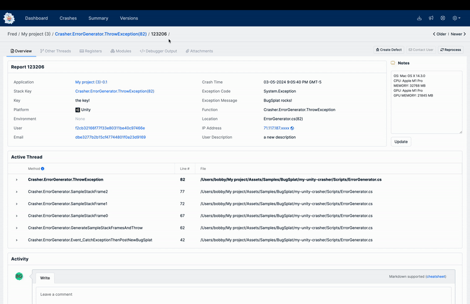

# Unity

### 🏗 Installation

BugSplat's `com.bugsplat.unity` package can be added to your project via [OpenUPM](https://openupm.com/packages/com.bugsplat.unity/) or a URL to our git [repository](https://github.com/BugSplat-Git/bugsplat-unity.git).

#### OpenUPM

Information on installing OpenUPM can be found [here](https://openupm.com/). After installing OpenUPM, run the following command to add BugSplat to your project.

```bash
openupm add com.bugsplat.unity
```

#### Git

Information on adding a Unity package via a git URL can be found [here](https://docs.unity3d.com/Manual/upm-ui-giturl.html).

```bash
https://github.com/BugSplat-Git/bugsplat-unity.git
```

### 🧑‍🏫 Sample

After installing `com.bugsplat.unity`, you can import a sample project to help you get started with BugSplat. Click here if you'd like to skip the sample project and get straight to the [usage](https://github.com/BugSplat-Git/bugsplat-unity#usage) instructions.

To import the sample, click the carrot next to **Samples** to reveal the **my-unity-crasher** sample. Click **Import** to add the sample to your project

<figure><figcaption><p>Importing the Sample</p></figcaption></figure>

In the Project Assets browser, open the **Sample** scene from `Samples > BugSplat > Version > my-unity-crasher > Scenes`.

Next, select `Samples > BugSplat > Version > my-unity-crasher` to reveal the **BugSplatOptions** object. Click BugSplatOptions and replace the database value with your BugSplat database.

<figure><figcaption><p>Finding the Sample</p></figcaption></figure>

<figure><figcaption><p>Configuring BugSplat</p></figcaption></figure>

Click **Play** and click or tap one of the buttons to send an error report to BugSplat. To view the error report, navigate to the BugSplat [Dashboard](https://app.bugsplat.com/v2/dashboard) and ensure you have selected the correct database.

<figure><figcaption><p>Running the Sample</p></figcaption></figure>

Navigate to the [Crashes](https://app.bugsplat.com/v2/crashes) page, and click the value in the ID column to see the details of your report, including the call stack, log file, and screenshot of your app when the error occurred.

<figure><figcaption><p>BugSplat Crash Page</p></figcaption></figure>

### ⚙️ Configuration

BugSplat's Unity integration is flexible and can be used in various ways. The easiest way to get started is to attach the `BugSplatManager` Monobehaviour to a GameObject.

<figure><figcaption><p>BugSplat Manager</p></figcaption></figure>

`BugSplatManager` needs to be initialized with a `BugSplatOptions` serialized object. A new instance of `BugSplatOptions` can be created through the Asset Create menu.

<figure><figcaption><p>BugSplat Create Options</p></figcaption></figure>

Configure fields as appropriate. Note that if Application or Version are left empty, `BugSplat` will default these values to `Application.productName` and `Application.version`, respectively

<figure><figcaption><p>BugSplat Options</p></figcaption></figure>

Finally, provide a valid `BugSplatOptions` to `BugSplatManager`

<figure><figcaption><p>BugSplat Manager Configured</p></figcaption></figure>

### ⌨️ Usage

If you're using `BugSplatOptions` and `BugSplatManager`, BugSplat automatically configures an `Application.logMessageReceived` handler that will post reports when it encounters a log message of type `Exception`. You can also extend your BugSplat integration and [customize report metadata](https://github.com/BugSplat-Git/bugsplat-unity#adding-metadata), [report exceptions in try/catch blocks](https://github.com/BugSplat-Git/bugsplat-unity#trycatch-reporting), [prevent repeated reports](https://github.com/BugSplat-Git/bugsplat-unity#preventing-repeated-reports), and [upload windows minidumps](https://github.com/BugSplat-Git/bugsplat-unity#windows) from native crashes.

#### Adding Metadata

First, find your instance of `BugSplat`. The following is an example of how to find an instance of `BugSplat` via `BugSplatManager`:

```csharp
var bugsplat = FindObjectOfType<BugSplatManager>().BugSplat;
```

You can extend `BugSplat` by setting the following properties:

```csharp
bugsplat.Attachments.Add(new FileInfo("/path/to/attachment.txt"));
bugsplat.Description = "description!";
bugsplat.Email = "fred@bugsplat.com";
bugsplat.Key = "key!";
bugsplat.Notes = "notes!";
bugsplat.User = "Fred";
bugsplat.CaptureEditorLog = true;
bugsplat.CapturePlayerLog = false;
bugsplat.CaptureScreenshots = true;
```

You can use the `Notes` field to capture arbitrary data such as system information:

```csharp
void Start()
{
    bugsplat = FindObjectOfType<BugSplatManager>().BugSplat;
    bugsplat.Notes = GetSystemInfo();
}

private string GetSystemInfo()
{
    var info = new Dictionary<string, string>();
    info.Add("OS", SystemInfo.operatingSystem);
    info.Add("CPU", SystemInfo.processorType);
    info.Add("MEMORY", $"{SystemInfo.systemMemorySize} MB");
    info.Add("GPU", SystemInfo.graphicsDeviceName);
    info.Add("GPU MEMORY", $"{SystemInfo.graphicsMemorySize} MB");

    var sections = info.Select(section => $"{section.Key}: {section.Value}");
    return string.Join(Environment.NewLine, sections);
}
```

#### Try/Catch Reporting

Exceptions can be sent to BugSplat in a try/catch block by calling `Post`.

```csharp
try
{
    throw new Exception("BugSplat rocks!");
}
catch (Exception ex)
{
    StartCoroutine(bugsplat.Post(ex));
}
```

The default values specified on the instance of `BugSplat` can be overridden in the call to `Post`. Additionally, you can provide a `callback` to `Post` that will be invoked with the result once the upload is complete.

```csharp
var options = new ReportPostOptions()
{
    Description = "a new description",
    Email = "barney@bugsplat.com",
    Key = "a new key!",
    Notes = "some new notes!",
    User = "Barney"
};

options.AdditionalAttachments.Add(new FileInfo("/path/to/additional.txt"));

static void callback()
{
    Debug.Log($"Exception post callback!");
};

StartCoroutine(bugsplat.Post(ex, options, callback));
```

#### Preventing Repeated Reports

By default, BugSplat prevents reports from being sent at a rate greater than 1 per every 60 seconds. You can override the default crash report throttling implementation by setting `ShouldPostException` on your BugSplat instance. To override `ShouldPostException`, assign the property a new `Func<Exception, bool>` value. Be sure your new implementation can handle a null value for `Exception`!

The following example demonstrates how you could implement your own time-based report throttling mechanism:

```csharp
var lastPost = new DateTime(0);

bugsplat.ShouldPostException = (ex) =>
{
    var now = DateTime.Now;

    if (now - lastPost < TimeSpan.FromSeconds(3))
    {
        Debug.LogWarning("ShouldPostException returns false. Skipping BugSplat report...");
        return false;
    }

    Debug.Log("ShouldPostException returns true. Posting BugSplat report...");
    lastPost = now;

    return true;
};
```

#### Support Response

BugSplat has the ability to display a support response to users who encounter a crash. You can show your users a generalized support response for all crashes, or a custom support response that corresponds to the type of crash that occurred. Defining a support response allows you to alert users that bug has been fixed in a new version, or that they need to update their graphics drivers.

Next, pass a callback to `bugsplat.Post`. In the callback handler add code to open the support response in the user's browser. A full example can be seen in [ErrorGenerator.cs](https://github.com/BugSplat-Git/bugsplat-unity/blob/main/Samples\~/my-unity-crasher/Scripts/ErrorGenerator.cs).

```csharp
private string infoUrl = "";

public void Event_CatchExceptionThenPostNewBugSplat()
{
    try
    {
        GenerateSampleStackFramesAndThrow();
    }
    catch (Exception ex)
    {
        var options = new ReportPostOptions()
        {
            Description = "a new description"
        };

        StartCoroutine(bugsplat.Post(ex, options, ExceptionCallback));
    }
}

void ExceptionCallback(ExceptionReporterPostResult result)
{
    UnityEngine.Debug.Log($"Exception post callback result: {result.Message}");

    if (result.Response == null) {
        return;
    }

    UnityEngine.Debug.Log($"BugSplat Status: {result.Response.status}");
    UnityEngine.Debug.Log($"BugSplat Crash ID: {result.Response.crashId}");
    UnityEngine.Debug.Log($"BugSplat Support URL: {result.Response.infoUrl}");

    infoUrl = result.Response.infoUrl;
}

private void OpenUrl(string url)
{
    var escaped = url.Replace("?", "\\?").Replace("&", "\\&").Replace(" ", "%20").Replace("!", "\\!");

#if UNITY_STANDALONE_WIN || UNITY_EDITOR_WIN || UNITY_WSA
    Process.Start(url);
#elif UNITY_STANDALONE_OSX || UNITY_EDITOR_OSX
    Process.Start("open", escaped);
#elif UNITY_STANDALONE_LINUX || UNITY_EDITOR_LINUX
    Process.Start("xdg-open", escaped);
#else
    UnityEngine.Debug.Log($"OpenUrl unsupported platform: {Application.platform}");
#endif
}
```

When an exception occurs, a page similar to the following will open in the user's browser on Windows, macOS, and Linux.

<figure><figcaption><p>BugSplat Support Response Page</p></figcaption></figure>

More information on support responses can be found [here](../../../production/setting-up-custom-support-responses.md).

### 🪟 Windows

BugSplat can be configured to upload Windows minidumps created by the `UnityCrashHandler`. BugSplat will automatically pull Unity Player symbols from the [Unity Symbol Server](https://docs.unity3d.com/Manual/WindowsDebugging.html). If your game contains Native Windows C++ plugins, `.dll` and `.pdb` files in the `Assets/Plugins/x86` and `Assets/Plugins/x86_64` folders will be uploaded by BugSplat's PostBuild script and used in symbolication.

#### Symbols

To enable the uploading of plugin symbols, generate an OAuth2 Client ID and Client Secret on the BugSplat [Integrations](https://app.bugsplat.com/v2/settings/database/integrations) page. Add your Client ID and Client Secret to the `BugSplatOptions` object you generated in the [Configuration](https://github.com/BugSplat-Git/bugsplat-unity#%E2%9A%99%EF%B8%8F-configuration) section. Once configured, plugins will be uploaded automatically the next time you build your project.

#### Minidumps

The methods `PostCrash`, `PostMostRecentCrash`, and `PostAllCrashes` can be used to upload minidumps to BugSplat. We recommend running `PostMostRecentCrash` when your game launches.

```csharp
StartCoroutine(bugsplat.PostCrash(new FileInfo("/path/to/crash/folder")));
StartCoroutine(bugsplat.PostMostRecentCrash());
StartCoroutine(bugsplat.PostAllCrashes());
```

Each of the methods that post crashes to BugSplat also accept a `MinidumpPostOptions` parameter and a `callback`. The usage of `MinidumpPostOptions` and `callback` are nearly identical to the `ExceptionPostOptions` example listed above.

You can generate a test crash on Windows with any of the following methods.

```csharp
Utils.ForceCrash(ForcedCrashCategory.Abort);
Utils.ForceCrash(ForcedCrashCategory.AccessViolation);
Utils.ForceCrash(ForcedCrashCategory.FatalError);
Utils.ForceCrash(ForcedCrashCategory.PureVirtualFunction);
```

### 🌎 UWP

To use BugSplat in a Universal Windows Platform application, you will need to add some capabilities to the `Package.appxmanifest` file in the solution directory that Unity generates at build time.

#### Capabilities

Reporting exceptions, crashes, and uploading log files requires the `Internet (Client)` capability.

#### Minidumps

We found that restricted capabilities were required in order to generate minidumps. Please see this Microsoft [document](https://docs.microsoft.com/en-us/windows/win32/wer/collecting-user-mode-dumps) that describes how to configure your system to generate minidumps for UWP native crashes.

To upload minidumps from `%LOCALAPPDATA%\CrashDumps` you will also need to add the `broadFileSystemAccess` restricted capability. To add access to the file system you will need to add the following to your `Package.appxmanifest`:

```xml
<Package xmlns:rescap="http://schemas.microsoft.com/appx/manifest/foundation/windows10/restrictedcapabilities" ... >
```

Under the `Capabilities` section add the `broadFileSystemAccess` capability:

```xml
<Capabilities>
    <rescap:Capability Name="broadFileSystemAccess" />
</Capabilities>
```

Finally, ensure that your application has access to the file system. The following is a snippet illustrating where this is set for our [my-unity-crasher](https://github.com/BugSplat-Git/my-unity-crasher) sample:

<figure><figcaption><p>Unity file system access</p></figcaption></figure>

### 🤖 Android

The bugsplat-unity plugin supports crash reporting for native C++ crashes on Android via Crashpad. To configure crash reporting for Android, set the `UseNativeCrashReportingForAndroid` and `UploadDebugSymbolsForAndroid` properties to `true` on the BugSplatManager instance.

You'll also need to configure the scripting backend to use IL2CPP, and target ARM64 (ARMV7a is not supported)

<figure><figcaption><p>Android Player Settings</p></figcaption></figure>

When you build your app for Android, be sure to set `Create symbols.zip` to `Debugging`

<figure><figcaption><p>Android Build Settings</p></figcaption></figure>

### 🍎 iOS

The bugsplat-unity plugin supports crash reporting for native C++ crashes on iOS via bugsplat-ios. To configure crash reporting for iOS, set the `UseNativeCrashReportingForIos` and `UploadDebugSymbolsForIos` properties to `true` on the BugSplatManager instance.

### 🧩 API

The following API methods are available to help you customize BugSplat to fit your needs.

#### BugSplatManager

<table><thead><tr><th width="319">Setting</th><th>Description</th></tr></thead><tbody><tr><td>DontDestroyManagerOnSceneLoad</td><td>Should the BugSplat Manager persist through scene loads?</td></tr><tr><td>RegisterLogMessageRecieved</td><td>Register a callback function and allow BugSplat to capture instances of LogType.Exception.</td></tr></tbody></table>

#### BugSplat Options

<table><thead><tr><th width="317">Option</th><th>Description</th></tr></thead><tbody><tr><td>Database</td><td>The name of your BugSplat database.</td></tr><tr><td>Application</td><td>The name of your BugSplat application. Defaults to Application.productName if no value is set.</td></tr><tr><td>Version</td><td>The version of your BugSplat application. Defaults to Application.version if no value is set.</td></tr><tr><td>Description</td><td>A default description that can be overridden by call to Post.</td></tr><tr><td>Email</td><td>A default email that can be overridden by call to Post.</td></tr><tr><td>Key</td><td>A default key that can be overridden by call to Post.</td></tr><tr><td>Notes</td><td>A default general purpose field that can be overridden by call to post</td></tr><tr><td>User</td><td>A default user that can be overridden by call to Post</td></tr><tr><td>CaptureEditorLog</td><td>Should BugSplat upload Editor.log when Post is called</td></tr><tr><td>CapturePlayerLog</td><td>Should BugSplat upload Player.log when Post is called</td></tr><tr><td>CaptureScreenshots</td><td>Should BugSplat a screenshot and upload it when Post is called</td></tr><tr><td>PostExceptionsInEditor</td><td>Should BugSplat upload exceptions when in editor</td></tr><tr><td>PersistentDataFileAttachmentPaths</td><td>Paths to files (relative to Application.persistentDataPath) to upload with each report</td></tr><tr><td>ShouldPostException</td><td>Settable guard function that is called before each BugSplat report is posted</td></tr><tr><td>SymbolUploadClientId</td><td>An OAuth2 Client ID value used for uploading <a href="https://docs.bugsplat.com/introduction/development/working-with-symbol-files">symbol files</a> generated via BugSplat's <a href="https://app.bugsplat.com/v2/settings/database/integrations">Integrations</a> page</td></tr><tr><td>SymbolUploadClientSecret</td><td>An OAuth2 Client Secret value used for uploading <a href="https://docs.bugsplat.com/introduction/development/working-with-symbol-files">symbol files</a> generated via BugSplat's <a href="https://app.bugsplat.com/v2/settings/database/integrations">Integrations</a> page</td></tr></tbody></table>

### 🧑‍💻 Contributing

BugSplat ❤️s open source! If you feel that this package can be improved, please open an [Issue](https://github.com/BugSplat-Git/bugsplat-unity/issues). If you have an awesome new feature you'd like to implement, we'd love to merge your [Pull Request](https://github.com/BugSplat-Git/bugsplat-unity/pulls). You can also send us an [email](mailto:support@bugsplat.com), join us on [Discord](https://discord.gg/K4KjjRV5ve), or message us via the in-app chat on [bugsplat.com](https://bugsplat.com/).
