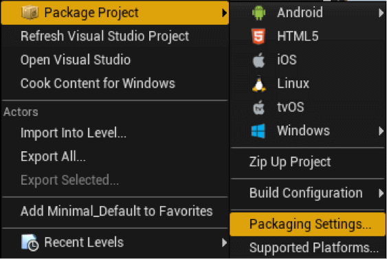
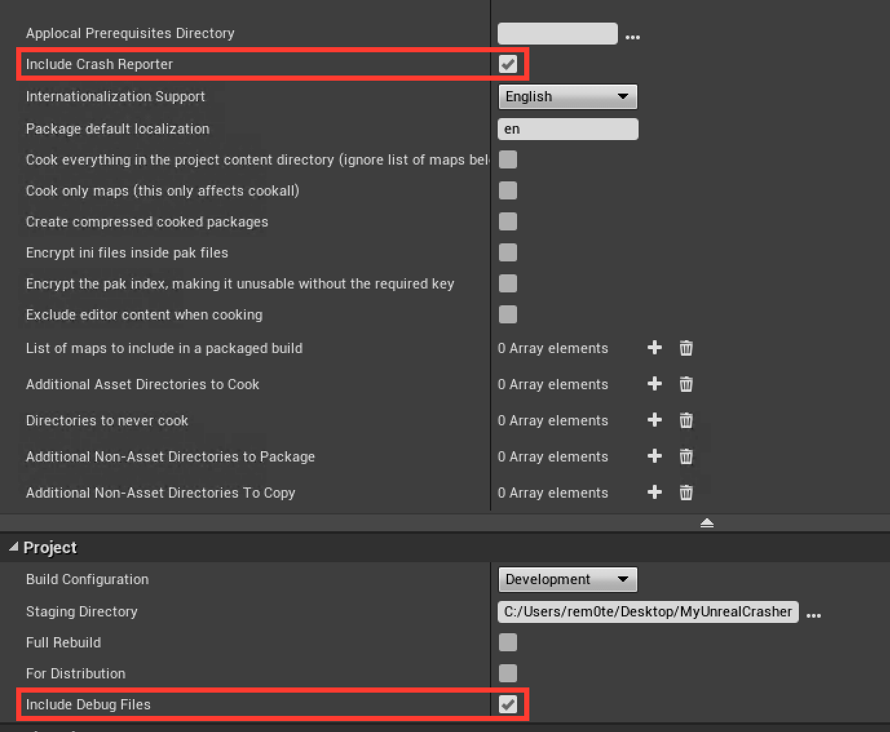

# Unreal Engine

## Overview

BugSplat’s Unreal Engine integration supports most Unreal platforms including desktop computers, the Steam platform, and Linux servers. Support for additional platforms will be provided in the future.


BugSplat is developing an Unreal Engine plugin to simplify various configuration steps. This plugin is in **beta** and can be installed by copying files into your game's Plugins folder. To try our BugSplat's Unreal Engine plugin see the [Plugin](unreal-engine.md#undefined) section below.


### Step 1

Package your game, check that the **Include Crash Reporter** and **Include Debug Files** options are selected in your build configuration:





### Step 2

Sending crash reports to BugSplat can be done via a simple configuration change to Unreal Engine's CrashReportClient. To configure crash upload to your BugSplat database, create a file named DefaultEngine.ini with the following contents:

```
[CrashReportClient]
CrashReportClientVersion=1.0
DataRouterUrl="https://{database}.bugsplat.com/post/ue4/{appName}/{appVersion}"
```

Replace {database}, {appName}, and {appVersion} with the names of your BugSplat database, application name, and version.


Remember the values you use for {database}, {appName}, and {appVersion}. You will need to use the same values when uploading [Symbols](../../../development/working-with-symbol-files/) in order to get crash reports with function names and line numbers in the call stack.



#### Spaces and special characters in {appName} or {appVersion} might cause unexpected behavior and should be avoided.


#### Unreal Engine 4.25 and older

For capturing crashes in packaged games in Unreal Engine 4.25 and earlier, **** copy `DefaultEngine.ini` to `{{output directory}}\Engine\Programs\CrashReportClient\Config\NoRedist` making sure to create folders that don't exist (where`{{output directory}}` is the location of your packaged build).

#### **Unreal Engine 4.26 and newer**

For capturing crashes in packaged games in Unreal Engine 4.26 and newer, copy`DefaultEngine.ini` to `{{output directory}}\Engine\Restricted\NoRedist\Programs\CrashReportClient\Config`  making sure to create folders that don't exist (where`{{output directory}}` is the location of your packaged build).

If DefaultEngine.ini already exists, add the snippet above anywhere in the file. There are multiple DefaultEngine.ini files in your tree, make sure you edit the right one otherwise crash reports will not be sent to BugSplat.

### Step 3

To create symbolic call stacks on Windows platforms you will need to upload symbol and executable files. The easiest way to upload files is to use our `SendPdbs` command line utility. `SendPdbs` can be downloaded either by [clicking here](https://app.bugsplat.com/browse/download\_item.php?item=sendpdbs) or via the [SendPDBs](../../../../education/faq/using-sendpdbs-to-automatically-upload-symbol-files.md) doc. Run it from your build folder using the following commands.

```bash
cd {your build folder}
SendPdbs.exe /u {username} /p {password} /b {database} /a {appName} /v {appVersion} /s /f "*.pdb;*.dll;*.exe"
```

### Step 4

Run your game. For testing, a crash can be forced from the console using the command "debug crash". After posting the crash report, log in to BugSplat to view the report.

### Step 5

Eventually, you will want to rebuild CrashReportClient so that its user interface describes the crash reporting changes above. However, this isn't required to successfully post crash reports.

### Step 6

Special instructions for Linux servers:

* Package the crash reporter with your Linux server build by adding the `-CrashReporter` flag to `PackageBuildLinuxServer.bat`
* Force a test crash by running your server executable with the option `-ExecCmds="debug crash"`

## Custom Fields

We extract metadata from `CrashContext.runtime-xml` file attached to Unreal Engine crash reports. In addition to the values that are provided by prebuilt versions of Unreal Engine, we support a few values our customers have added to their customized engine builds. You can add the following XML fields as child properties of `RuntimeProperties`:

| Name                   | Description                           |
| ---------------------- | ------------------------------------- |
| BugSplatNotes          | A value persisted to the Notes column |
| BugSplatApplicationKey | A value persisted to the Key column   |

## Forwarding Crashes to Epic Games

If you'd like to forward crashes to the original `DataRouterUrl` specified in `DefaultEngine.ini` you can enable the **Forward Crashes** option under the Privacy tab on the [Settings](https://app.bugsplat.com/v2/settings/database/privacy) page. Forwarding crash reports to Epic is useful when a crash in your game is caused by the underlying engine and you are working with Epic Games to resolve the issue. If the Forward to Epic option is enabled, an Epic Correlation-ID will be added to the description of all Unreal Engine crashes that were successfully forwarded to Epic.

## Unreal Engine Plugin


This plugin is useful for evaluating [BugSplat](https://bugsplat.com). For shipping games, we recommend you use a script in your build pipeline for symbol uploads and incrementing the version portion of the DataRouterUrl field in `DefaultEngine.ini` in your packaged game.


BugSplat is developing an Unreal Engine [plugin](https://github.com/BugSplat-Git/bugsplat-unreal) that simplifies the configuration of crash reporting in Unreal Engine games.&#x20;

BugSplat's Unreal Engine plugin can be used to configure CrashReportClient's [DataRouterUrl](unreal-engine.md#step-2) with application and version information which is useful for evaluating BugSplat. Additionally, the plugin can generate a script for uploading [symbol files](../../../development/working-with-symbol-files/) so that crash reports contain function names and line numbers in their call stacks. The plugin currently supports adding crash reporting to Window games. Support for macOS, Linux, iOS, Android, Xbox, and PlayStation are coming soon. The BugSplat Unreal plugin supports Unreal Engine 4.26, 4.27, and 5.0.

To get started with BugSplat's Unreal Engine plugin please check out our [GitHub](https://github.com/BugSplat-Git/bugsplat-unreal) repo. Additionally, an example game, configured with BugSplat's Unreal Engine plugin can be found [here](https://github.com/BugSplat-Git/my-unreal-crasher).

#### Install from GitHub

1. Navigate to your project folder, which contains your `[ProjectName].uproject` file.
2. If it does not already exist, create a `Plugins` folder.
3. Create a `BugSplat` folder in the `Plugins` folder and copy the contents of the [bugsplat-unreal](https://github.com/BugSplat-Git/bugsplat-unreal) repo into the `BugSplat` folder.
4. In the Unreal Editor, ensure you can access the BugSplat plugin via `Edit > BugSplat`.

#### Windows

For Windows, the BugSplat plugin has the ability to modify both the global engine, and packaged build versions of [DefaultEngine.ini](https://docs.unrealengine.com/5.0/en-US/configuration-files-in-unreal-engine/) so that crashes are posted to BugSplat. Additionally, the BugSplat plugin can add a [PostBuildStep](https://docs.unrealengine.com/5.0/en-US/unreal-engine-build-tool-target-reference/) that will upload [symbol files](https://docs.bugsplat.com/introduction/development/working-with-symbol-files) to BugSplat after each build.

To get started, access the BugSplat plugin menu in the Unreal Editor via `Edit > BugSplat`.

Add values for `Database`, `Application`, `Version`, `Client ID`, and `Client Secret`. Note that a `Client ID` and `Client Secret` are generated on the [Integrations](https://app.bugsplat.com/v2/settings/database/integrations) page.


.png>)

Once you are happy with your configuration settings, you can choose which `DefaultEngine.ini` to update depending on your build process and preferences.

If you would like BugSplat to be configured for every new packaged build, select `Update Global Ini`. Note that updating the global `DefaultEngine.ini` file \*_will affect all projects_ using the same engine build. The advantage of this approach is will only need to be repeated when your configuration settings change, but does not need to be repeated every build.

If you would like to add BugSplat to a packaged build, select `Update Game Ini`. When prompted, navigate to the root directory of your packaged build that contains the folder `Windows` or `WindowsNoEditor`. Note that you will need to **repeat this step every time you create a packaged version of your game**.


If you would like BugSplat to automatically upload symbol files during package time, select `Add Symbol Uploads`. This will generate a bash script which uploads your project's [symbol files](https://docs.bugsplat.com/introduction/development/working-with-symbol-files) to BugSplat. Symbol files are needed to get function names and line numbers in crash reports. A script to execute [SendPdbs.exe](https://docs.bugsplat.com/education/faq/using-sendpdbs-to-automatically-upload-symbol-files) will be added to the `PostBuildSteps` field in `BugSplat.uplugin` and will run automatically when your game is built.

Once you've installed the plugin, execute a snippet of C++ that will generate a crash.

```
UE_LOG(LogTemp, Fatal, TEXT("BugSplat!"));
```

Submit the crash report and navigate to the [Crashes](https://app.bugsplat.com/v2/crashes) page. On the Crashes page, click the link in the ID column.

If everything is configured correctly, you should see something that resembles the following:

.png>)
