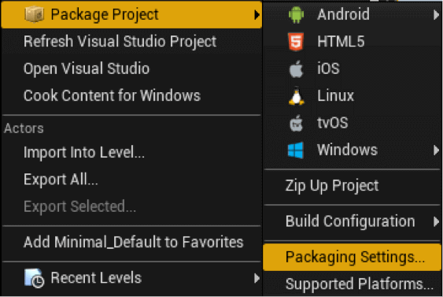
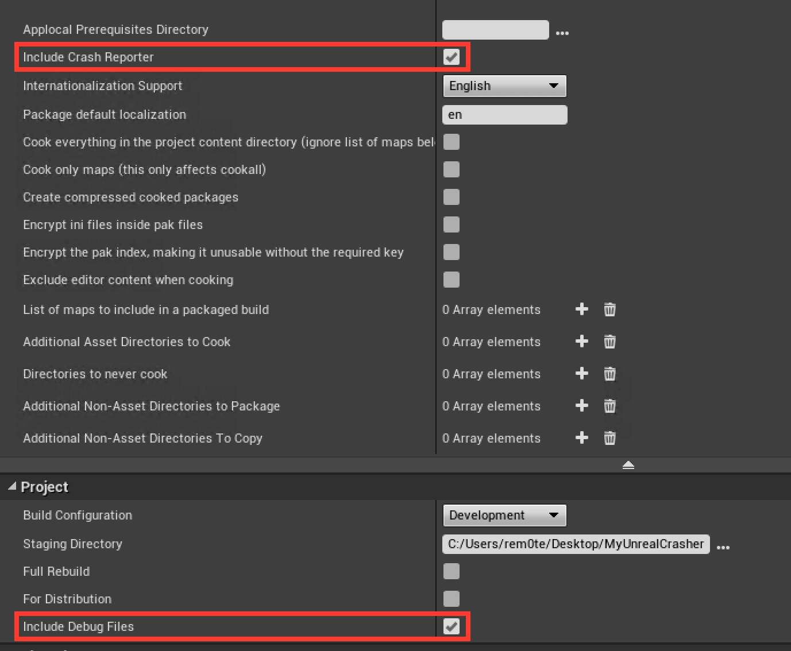

# Unreal Engine


If you are a developer looking to try BugSplat on your local machine, we've created a [Plugin](unreal-engine/unreal-engine-plugin.md) to help you get started.


BugSplat’s Unreal Engine integration supports capturing crashes on Windows, macOS, Linux, iOS, Android, Xbox, PlayStation and Switch 2 games. BugSplat also supports both Windows and Linux servers.

There are two options for configuring BugSplat. If you are integrating BugSplat for an organization that uses a dedicated build machine, please continue reading.&#x20;

## Windows 🪟

You must upload symbol and executable files to create symbolic call stacks on Windows platforms. The easiest way to upload files is to use our [symbol-upload](../../../../education/faq/how-to-upload-symbol-files-with-symbol-upload.md) command line utility. You can download `symbol-upload` [here](https://github.com/BugSplat-Git/symbol-upload/releases).

### Symbol Uploads

Add a step to your build pipeline that uploads `.exe`, `.dll`, and `.pdb` files via [symbol-upload](../../../../education/faq/how-to-upload-symbol-files-with-symbol-upload.md). We recommend creating an [OAuth Client ID/Client Secret](../../../development/web-services/oauth2.md#client-credentials) pair for authentication.

```bash
cd {your build folder}
symbol-upload-windows.exe -i {client id} -s {client secret} -b {database} -a {appName} -v {appVersion} -f "**/*.{pdb,exe,dll}"
```

The `appName` and `appVersion` parameters will be associated with your uploaded symbols, allowing logical grouping of files within BugSplat for easier symbol management. BugSplat will automatically remove symbol stores that have not been accessed recently. See our [FAQ](../../../../education/faq/how-do-i-remove-symbol-files.md#automatically) for a description of these rules.

### Packaging Settings

Package your game, and check the **Include Crash Reporter** and **Include Debug Files** options are selected in your build configuration:





If you're building via the command line, please add the `-CrashReporter` flag to your build arguments to ensure CrashReportClient is included in your build output.

### Configuring Crash Report Client

Sending crash reports to BugSplat can be done via a simple configuration change to Unreal Engine's [CrashReportClient](https://blog.bugsplat.com/customizing-the-unreal-engine-crash-report-client/).

There are two options for configuring CrashReportClient. The first option is modifying the `DefaultEngine.ini` file for an engine install or source build. Modifying the engine's config file is the easiest approach but has the downside of affecting every game you build with this version. Alternatively, you can add `DefaultEngine.ini` to a specific path in your packaged build directory, which will overwrite values specified by the engine.

#### Option 1: Editor and Engine Crashes

Unreal Editor can also be configured to send crash reports to BugSplat. To do this, add the following DefaultEngine.ini file in `C:\Path\To\Engine_Install_or_Source_Checkout\Programs\CrashReportClient\Config\DefaultEngine.ini.`

```
[CrashReportClient]
CrashReportClientVersion=1.0
DataRouterUrl="https://{database}.bugsplat.com/post/ue4/{appName}/{appVersion}"
```

#### Option 2: Packaged Builds

To configure crash uploads to your BugSplat database, create a file named `DefaultEngine.ini` with the following contents:

```
[CrashReportClient]
CrashReportClientVersion=1.0
DataRouterUrl="https://{database}.bugsplat.com/post/ue4/{appName}/{appVersion}"
```

Replace `{database}`, `{appName}`, and `{appVersion}` with the names of your BugSplat database, application name, and version. The appName and appVersion parameters will be assigned to each crash report posted to your database, allowing you to group and filter crashes within BugSplat. These parameters should match the corresponding values used for SendPdbs.


**Be sure to URL encode spaces and special characters in {appName} or {appVersion}**


#### Unreal Engine 4.25 and older

For capturing crashes in packaged games in Unreal Engine 4.25 and earlier, copy `DefaultEngine.ini` to `{{output directory}}\Engine\Programs\CrashReportClient\Config\NoRedist` making sure to create folders that don't exist (where`{{output directory}}` is the location of your packaged build).

#### **Unreal Engine 4.26 and newer**

For capturing crashes in packaged games in Unreal Engine 4.26 and newer, copy`DefaultEngine.ini` to `{{output directory}}\Engine\Restricted\NoRedist\Programs\CrashReportClient\Config` making sure to create folders that don't exist (where`{{output directory}}` is the location of your packaged build).

If `DefaultEngine.ini` already exists, add the snippet above anywhere in the file. There are multiple `DefaultEngine.ini` files in your tree. Ensure you edit the right DefaultEngine.ini file; otherwise, crash reports will not be sent to BugSplat.

### Timeouts

When a user submits a crash report, it can take a considerable amount of time to upload, depending on the size of the crashing application, the contents of the crash report, and the user's network connection. Sometimes, the crash upload can fail because Unreal Engine's default HTTP timeout is 30 seconds. You can check if you're experiencing this issue by reviewing the Error page.

<figure><figcaption></figcaption></figure>

The simplest way to fix this issue is to add the following to `[Your Game]/Config/DefaultEngine.ini`:

```ini
[HTTP]
HttpConnectionTimeout=90
HttpActivityTimeout=90
HttpTotalTimeout=90
```

Alternatively, you can change the upload timeout for the crash upload without affecting the rest of the engine by modifying [CrashUpload.cpp](https://github.com/EpicGames/UnrealEngine/blob/803688920e030c9a86c3659ac986030fba963833/Engine/Source/Runtime/CrashReportCore/Private/CrashUpload.cpp#L815-L825).

```diff
auto Request = CreateHttpRequest();
Request->SetVerb(TEXT("POST"));
Request->SetHeader(TEXT("Content-Type"), TEXT("application/octet-stream"));
Request->SetURL(DataRouterUrl + UrlParams);
+ Request->SetTimeout(90.0f);
Request->SetContent(CompressedData.Data);
```

### Trigger a Crash

Run your game. For testing, a crash can be forced from the console using the command "debug crash". After posting the crash report, log in to BugSplat to view the report.

### Optional: Customize Crash Report Client

The default CrashReportClient contains text explaining to the user that the crash reports are being sent to Epic. However, by overwriting the CrashReportClient configuration settings, crash reports are instead sent to BugSplat. It is a good idea to change the text and rebuild CrashReportClient. Customizing CrashReportClient requires rebuilding the engine source.

Please see our [blog](https://blog.bugsplat.com/customizing-the-unreal-engine-crash-report-client/) for more information on how to [customize Unreal's CrashReportClient](https://blog.bugsplat.com/customizing-the-unreal-engine-crash-report-client/).

## Linux Servers 🐧

Special instructions for Linux servers:

* Package the crash reporter with your Linux server build by adding the `-CrashReporter` flag to `PackageBuildLinuxServer.bat`
* Force a test crash by running your server executable with the option `-ExecCmds="debug crash"`

Symbolic call stacks are resolved if you deploy symbols on your server. This is the typical case. However, if symbols aren't available locally, upload the Unreal Linux custom symbol files (`.psym` extension) using [symbol-upload](../../../../education/faq/how-to-upload-symbol-files-with-symbol-upload.md).

## iOS 🍎

You will need to configure [bugsplat-ios](../mobile/ios.md) to capture iOS crash reports. Additionally, you'll need to upload `.dSYM` files for function names and line numbers to be included in crash reports. Symbol files can be uploaded automatically by invoking [symbol-upload](../../../../education/faq/how-to-upload-symbol-files-with-symbol-upload.md).

## Android 🤖

You will need to configure [Crashpad](../mobile/android.md) to capture Android crash reports. Additionally, you'll need to generate symbol files from your `.so` files for function names and line numbers to be included in crash reports. Symbol files can be generated and uploaded automatically by invoking [symbol-upload](../../../../education/faq/how-to-upload-symbol-files-with-symbol-upload.md) with the `-m` flag.

## Check, Verify, and Ensure Reporting ✅

Unreal Engine's `check`, `verify`, and `ensure` macros can all send crash reports to BugSplat. Checks and Verifies report automatically since they terminate the application. Ensures require additional configuration—in Shipping builds, you'll need to set `bUseChecksInShipping = true` in your `*.Target.cs` file to keep them active.

For the complete guide on configuring ensure reporting, controlling report volume, and troubleshooting, see [Unreal Assert, Check, and Ensure Reporting](unreal-engine/unreal-assert-check-and-ensure-reporting.md).

## Licensee Builds 🤝

Some forks of Unreal (e.g., Oculus) are set up as a "Licensee" build. Regardless of other settings, crash reports won't be sent because of this [block of code](https://github.com/EpicGames/UnrealEngine/blob/5ccd1d8b91c944d275d04395a037636837de2c56/Engine/Source/Runtime/Core/Private/Unix/UnixPlatformCrashContext.cpp#L594-L600):

```cpp
if (BuildSettings::IsLicenseeVersion() && !UD_EDITOR)
{
    // do not send unattended reports in licensees' builds except for the editor, where it is governed
    bSendUnattendedBugReports = false;
    bAgreeToCrashUpload = false;
    bSendUsageData = false;
}
```

To upload crash reports to BugSplat, recompile with `bSendUnattendedBugReports = true`.

## Custom Fields 📝

BugSplat extracts metadata from the `CrashContext.runtime-xml` file attached to Unreal Engine crash reports and convert those values into [Attributes](../../../../education/how-tos/using-the-crash-attribute-feature.md) that can be displayed in the web application. See the [Unreal Engine Crash Reporting documentation](https://dev.epicgames.com/documentation/en-us/unreal-engine/crash-reporting-in-unreal-engine) for information on adding additional data.

The following XML fields, if created as child properties of `RuntimeProperties` or `GameData` can be used to set the specified BugSplat crash fields.&#x20;

<table><thead><tr><th width="374">Property</th><th>Description</th></tr></thead><tbody><tr><td>BugSplatApplicationKey</td><td>Sets the value of the crash Key field</td></tr><tr><td>BugSplatNotes</td><td>Sets the value of the crash Notes field </td></tr><tr><td>UserEmail</td><td>Sets the value of the crash Email field</td></tr><tr><td>UserName</td><td>Sets the value of the crash User field.  The UserID URL parameter will take precedence if it is set.</td></tr></tbody></table>

All other properties will be parsed as [Attributes](../../../../education/how-tos/using-the-crash-attribute-feature.md).

<pre class="language-cpp"><code class="lang-cpp">#include "MyUnrealCrasherGameModeBase.h"
#include "GenericPlatform/GenericPlatformCrashContext.h"

AMyUnrealCrasherGameModeBase::AMyUnrealCrasherGameModeBase()
{
<strong>    // BugSplat override fields for overriding values on the Crash Details page
</strong>    FGenericCrashContext::SetGameData(TEXT("BugSplatApplicationKey"), TEXT("en-US"));
    FGenericCrashContext::SetGameData(TEXT("BugSplatNotes"), TEXT("Development Build"));
    FGenericCrashContext::SetGameData(TEXT("UserEmail"), TEXT("fred@bugsplat.com"));
    FGenericCrashContext::SetGameData(TEXT("UserName"), TEXT("wonderfulmuffin27"));

    // GameData values will be parsed as Attributes by BugSplat
    FGenericCrashContext::SetGameData(TEXT("CurrentWorld"), TEXT("Alpha Centari"));
    FGenericCrashContext::SetGameData(TEXT("GamePads"), TEXT("1"));
    FGenericCrashContext::SetGameData(TEXT("IsExternalQABuild"), TEXT("true"));
}
</code></pre>

## User Feedback 💬

In addition to crash reporting, BugSplat supports collecting non-crashing user feedback such as bug reports and feature requests. Feedback reports appear in BugSplat with the "User Feedback" type, grouped by title.

The BugSplat Unreal plugin provides two ways to collect user feedback:

### Built-in Feedback Dialog

The plugin includes a ready-to-use feedback dialog. To add it to your game:

1. Open any Widget Blueprint (e.g., your HUD or main menu).
2. Add a **Button** widget and position it where you'd like the feedback trigger to appear.
3. In the button's **Events** section, click the **+** next to **On Clicked**.
4. In the Event Graph, search for **Show Feedback Dialog** (under the BugSplat category) and connect it to the On Clicked event.

The dialog includes a subject field, optional description, and an "Include application logs" checkbox that attaches the Unreal Engine log file. Crash context attributes (engine version, platform, CPU, GPU, memory, OS) are included automatically with every submission.

### Custom Feedback UI

If you'd prefer to build your own feedback UI, call `UBugSplatFeedback::PostFeedback` directly. It reads Database, Application, and Version from your plugin settings and handles the HTTP submission, crash context attributes, and file attachments.

#### C++

```cpp
#include "BugSplatFeedback.h"

// Simple feedback
UBugSplatFeedback::PostFeedback(
    TEXT("Login button broken"),            // Title (required)
    TEXT("Nothing happens when I tap it"),  // Description
    TArray<FString>()                       // Attachments
);
```

To include file attachments, user info, and custom attributes:

```cpp
#include "BugSplatFeedback.h"

TArray<FString> Attachments;
Attachments.Add(UBugSplatFeedback::GetLogFilePath());
Attachments.Add(FPaths::ProjectSavedDir() / TEXT("screenshot.png"));

TMap<FString, FString> CustomAttributes;
CustomAttributes.Add(TEXT("Level"), TEXT("Tutorial_03"));
CustomAttributes.Add(TEXT("PlaytimeMinutes"), TEXT("42"));

UBugSplatFeedback::PostFeedback(
    TEXT("Login button broken"),        // Title (required)
    TEXT("Nothing happens when I tap"), // Description
    Attachments,                        // File paths
    TEXT("Jane"),                        // User
    TEXT("jane@example.com"),           // Email
    TEXT(""),                            // AppKey
    CustomAttributes                    // Merged with crash context attributes
);
```

The full `PostFeedback` signature:

| Parameter | Required | Description |
|-----------|----------|-------------|
| `Title` | Yes | Brief summary of the feedback (becomes the stack key) |
| `Description` | No | Additional details |
| `Attachments` | No | Array of absolute file paths to attach |
| `User` | No | Username of the person submitting |
| `Email` | No | Email of the person submitting |
| `AppKey` | No | Application key |
| `CustomAttributes` | No | Key-value pairs merged with crash context attributes |

#### Blueprints

Call the **Post Feedback** node from `BugSplatFeedback`. The advanced parameters (User, Email, AppKey, CustomAttributes) are collapsed by default — expand the node to access them. Use the **Get Log File Path** node to get the path to the current Unreal Engine log file.

For the full API, see [`BugSplatFeedback.h`](https://github.com/BugSplat-Git/bugsplat-unreal/blob/main/Source/BugSplatRuntime/Public/BugSplatFeedback.h). The built-in dialog in [`BugSplatFeedbackDialog.cpp`](https://github.com/BugSplat-Git/bugsplat-unreal/blob/main/Source/BugSplatRuntime/Private/BugSplatFeedbackDialog.cpp) serves as a reference implementation.
