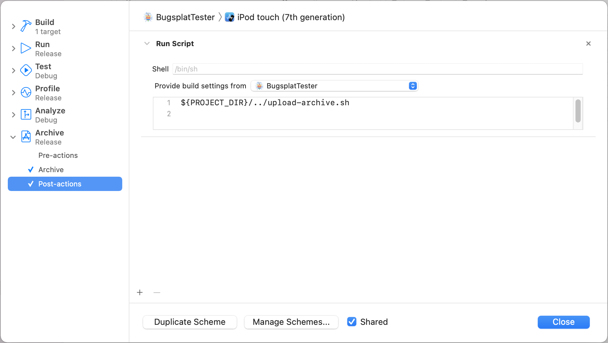

# iOS

## Introduction

The BugSplat iOS framework enables posting crash reports from iOS applications to BugSplat. Visit [http://www.bugsplat.com](http://www.bugsplat.com) for more information and to sign up for an account.

## 1. Requirements

* BugSplat supports iOS 13 and later.

## 2. Integration

BugSplat supports multiple methods for installing the library in a project.

### Installation with CocoaPods

[CocoaPods](http://cocoapods.org) is a dependency manager, which automates and simplifies the process of using 3rd-party libraries like BugSplat in your projects. You can install it with the following command:

```bash
$ gem install cocoapods
```

#### Podfile

To integrate BugSplat into your Xcode project using CocoaPods, specify it in your `Podfile`:

```ruby
target 'TargetName' do
pod 'Bugsplat'
end
```

Then, run the following command:

```bash
$ pod install
```

The pod install command creates an xcworkspace file next to your application's xcodeproj file. Open the xcworkspace file in lieu of the xcodeproj file to ensure Bugsplat.framework is included in your build.

### Swift Package Manager

BugSplat framework binaries are also now distributed via Swift Package Manager. You can now add BugSplat as a dependency in the Swift Packages configuration in your Xcode project by pointing to [https://github.com/BugSplat-Git/BugSplat-iOS](https://github.com/BugSplat-Git/BugSplat-iOS)

### Manual Setup

To use this library in your project manually you may:

1. Download the latest release from [https://github.com/BugSplatGit/BugSplat-iOS/releases](https://github.com/BugSplat-Git/BugSplat-iOS/releases) which is provided as a zip file
2. Unzip the archive and add Bugsplat.xcframework to your Xcode project
3. Drag & drop `Bugsplat.xcframework` from your window in the `Finder` into your project in Xcode and move it to the desired location in the `Project Navigator`
4. A popup will appear. Select `Create groups for any added folders` and set the checkmark for your target. Then click `Finish`.
5. Configure the framework to be copied into your app bundle:
6. Click on your project in the `Project Navigator` \(⌘+1\).
7. Click your target in the project editor.
8. Click on the `Build Phases` tab.
9. Click the `Add Build Phase` button at the bottom and choose `Add Copy Files`.
10. Click the disclosure triangle next to the new build phase.
11. Choose `Frameworks` from the Destination list.
12. Drag `Bugsplat` from the Project Navigator left sidebar to the list in the new Copy Files phase.

## 3. Usage

#### Configuration

BugSplat requires a few configuration steps in order integrate the framework with your BugSplat account

* Add the following key to your app's Info.plist replacing DATABASE\_NAME with your BugSplat database name

  ```text
    <key>BugsplatServerURL</key>
    <string>https://DATABASE_NAME.bugsplat.com/</string>
  ```

#### Symbol Upload

* You must upload an archive containing your app's binary and symbols to the BugSplat server in order to symbolicate crash reports. There are scripts to help with this.
  * Create a ~/.bugsplat.conf file to store your BugSplat credentials

    ```text
      BUGSPLAT_USER="<username>"
      BUGSPLAT_PASS="<password>"
    ```

  * One option is to use `upload-symbols.sh` to upload a zip containing the app and dSYM files. This can be run on the command line or integrated into your build/CI process.
  * Another option is to upload an xcarchive generated by Xcode by adding the upload-archive.sh script located in `${PROJECT_DIR}` as an Archive post-action in your build scheme. Set the "Provide build settings from" target in the dropdown so that the `${PROJECT_DIR}` environment variable can be used to locate upload-archive.sh. The script will be invoked when archiving completes which will upload the xcarchive to BugSplat for processing. You can view the script output in `/tmp/bugsplat-upload.log`.  To share amongst your team, mark the scheme as 'Shared'.



#### Initialization \(Swift example\)

```swift
import Bugsplat
```

```swift
@main
struct BugsplatTesterApp: App {

    init() {
        BugsplatStartupManager.shared().start()
    }

    var body: some Scene {
        WindowGroup {
            ContentView()
        }
    }
}
```

#### Bitcode

Bitcode was introduced by Apple to allow apps sent to the App Store to be recompiled by Apple itself and apply the latest optimization. If Bitcode is enabled, the symbols generated for your app in the store will be different than the ones from your own build system. We recommend that you disable bitcode in order for BugSplat to reliably symbolicate crash reports. Disabling bitcode significantly simplifies symbols management and currently doesn't have any known downsides for iOS apps.

