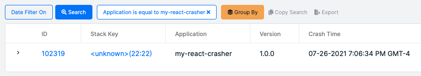
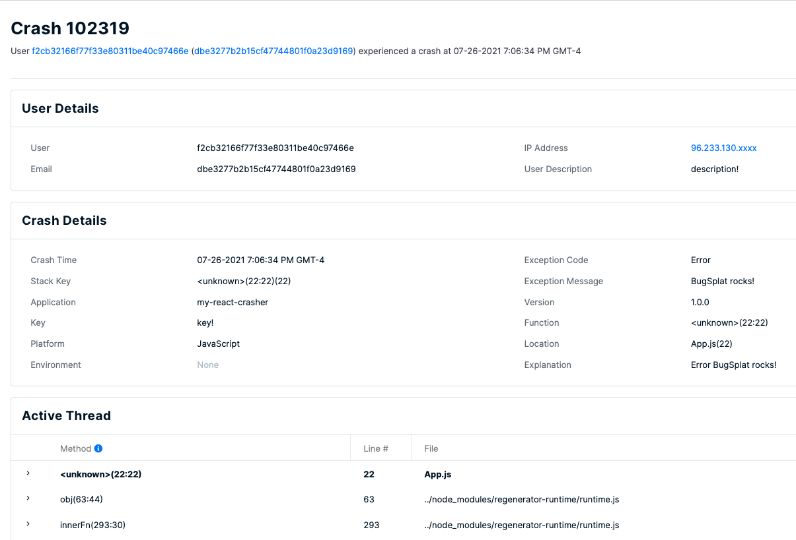

# React

## Introduction

BugSplat's [npm package](https://www.npmjs.com/package/bugsplat) provides error reporting for React applications. Before integrating your application with BugSplat, make sure to review the [Getting Started](../../) resources and complete the simple startup tasks listed below.

* [Sign up](https://app.bugsplat.com/v2/sign-up) for a BugSplat account
* [Log in](https://app.bugsplat.com/auth0/login) using your email address
* Create a new [database](https://app.bugsplat.com/v2/company) for your application

Please also review our [my-react-crasher](https://github.com/BugSplat-Git/my-react-crasher) sample to see an example application configured with BugSplat.


Need any further help? Check out the full BugSplat documentation [here](../../../../), or email the team at [support@bugsplat.com](mailto:support@bugsplat.com).


## Integration

BugSplat’s [npm package](https://www.npmjs.com/package/bugsplat) supports the collection of errors in React applications. Source map files can be uploaded to BugSplat via [@bugsplat/symbol-upload](https://www.npmjs.com/package/@bugsplat/symbol-upload). Additionally, BugSplat’s backend leverages [@bugsplat/stack-converter](https://www.npmjs.com/package/@bugsplat/stack-converter) to convert stack traces in JavaScript back to their original JSX or TSX file names and line number. BugSplat provides you with invaluable insight into the issues tripping up your users so that you can fix bugs and deliver a better user experience.

To configure your app with BugSplat add the bugsplat package via npm.

```bash
npm i bugsplat
```

Import BugSplat at the entry point of your application.

```typescript
import { BugSplat } from 'bugsplat';
```

Add a database property to your package.json.

```typescript
{
  "name": "my-react-crasher",
  "version": "1.0.0",
  "database": "{{ your database here}}",
  ...
}
```

In index.js, create a new instance of BugSplat and pass the constructor values for database, application, and version from your package.json.

```typescript
const packageJson = require('../package.json');
const bugsplat = new BugSplat(packageJson.database, packageJson.name, packageJson.version);
```

Add event handlers to window.onunhandledrejection and window.onerror so that errors are posted to BugSplat.

```typescript
window.onunhandledrejection = async (rejection) => {
  await bugsplat.post(rejection.reason);
}

window.onerror = async (event, source, lineno, colno, error) => {
  await bugsplat.post(error);
}
```

You can inject BugSplat into your child components or create a new instance and also use BugSplat to capture errors in catch blocks.

```markup
<button onClick={catchError}>
  Try Catch!
</button>
```

```typescript
async function catchError(e) {
    e.preventDefault();
    try {
      throw new Error('BugSplat rocks!');
    } catch (error) {
      await bugsplat.post(error);
    }
}
```

After posting an error, navigate to the Crashes page in BugSplat and you should see a new error report for the application you just configured. Click the link in the **ID** column to see details about your crash on the Crash page.





That’s it! Your application is now configured to post crash reports to BugSplat.

### **API**

In addition to the configuration demonstrated above, there are a few public methods that can be used to customize your BugSplat integration.

```typescript
bugsplat.setDefaultAppKey(appKey); // Additional metadata that can be queried via BugSplat's web application
bugsplat.setDefaultUser(user); // The name or id of your user
bugsplat.setDefaultEmail(email); // The email of your user
bugsplat.setDefaultDescription(description); // Additional info about your crash that gets reset after every post
async bugsplat.post(error, options); // Posts an arbitrary Error object to BugSplat
// If the values options.appKey, options.user, options.email, options.description are set the corresponding default values will be overwritten
// Returns a promise that resolves with properties: error (if there was an error posting to BugSplat), response (the response from the BugSplat crash post API), and original (the error passed by bugsplat.post)
```

### **Contributing**

BugSplat ❤️s open source! If you feel that this integration can be improved, please open an [Issue](https://github.com/BugSplat-Git/bugsplat-unity/issues). If you have an awesome new feature you'd like to implement, we'd love to merge your [Pull Request](https://github.com/BugSplat-Git/bugsplat-unity/pulls). You can also reach out to us via an email to [support@bugsplat.com](mailto:support@bugsplat.com) or the in-app chat on bugsplat.com.\
\
