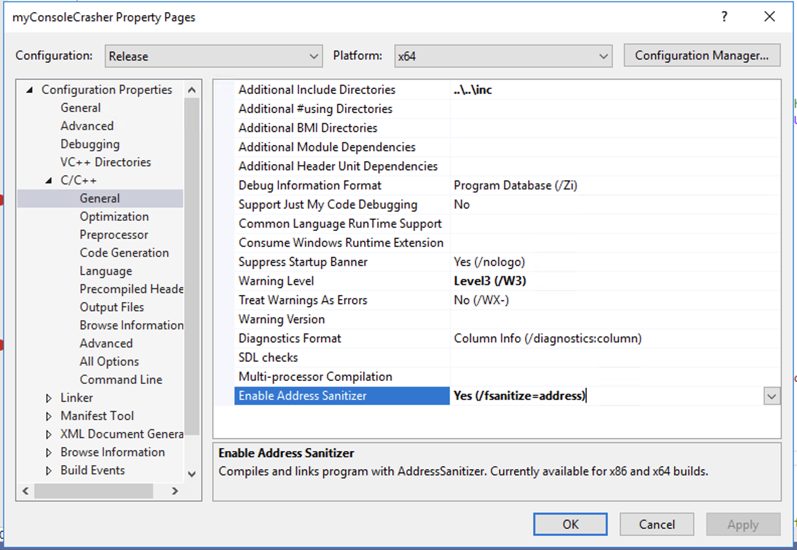
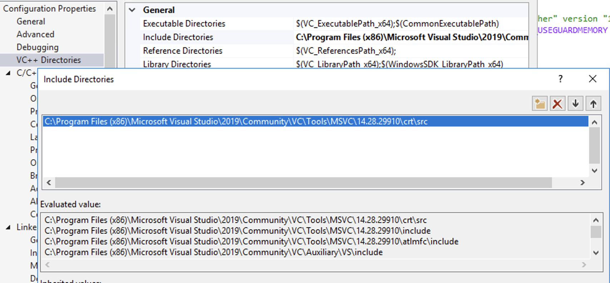
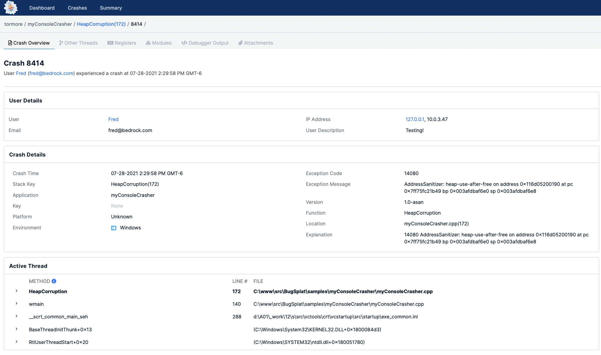

# Address Sanitizer Reports

BugSplat integrates with the Windows Address Sanitizer \(Asan\) complier option allowing you to capture memory error reports and send them to your BugSplat database.  Here are some instructions for modifying myConsoleCrasher \(or your application\) so that it captures Address Sanitizer exceptions.

## Modify Visual Studio Compiler Options

Enable the Address Sanitizer by choosing the Enable Address Sanitizer \(/fsanitize=address\) C/C++ General option:



Modify the Visual Studio Include Directories so that the Address Sanitizer header files can be located: 



## Modify Initialization Code 

To hook into the Address Sanitizer you will call **\_\_asan\_set\_error\_report\_callback** __with the BugSplat **createAssanReport** method.  To do this, we'll need a global instance of the BugSplat MiniDmpSender object and a new asanCallback function. See below for how you would modify our myConsoleCrasher sample program:

```text
...
#include "sanitizer/asan_interface.h"
...

// Global BugSplat initialization. 
MiniDmpSender* mpSender = new MiniDmpSender(L"YourDatabase", L"YourAppName", L"YourAppVersion", NULL, MDSF_USEGUARDMEMORY | MDSF_LOGFILE | MDSF_PREVENTHIJACKING);

void asanCallback(const char* message)
{
   mpSender->createAsanReport(message);
}

int wmain(int argc, wchar_t** argv)
{
	if (IsDebuggerPresent())
	{
		exit(0);
	}

	__asan_set_error_report_callback(asanCallback);
	
	...

```

## Create Memory Corruption Test 

The only step left is to generate a memory corruption that Address Sanitizer will catch.  Here's one way to do that:

```text
void HeapCorruption() {
	void* pointerArray[20];
	struct simple_struct {
		double b;
		double c;
		char d;
	};

	{
		auto a = new simple_struct;
		auto b = new simple_struct;

		pointerArray[0] = a;
		pointerArray[1] = b;
	}

	// Function attempts to use pointer from array.
	// Encounters an error and deletes the pointer without removing it from array
	{
		auto item = reinterpret_cast<simple_struct*>(pointerArray[1]);
		delete item;
	}

	// Program continues, address is reused
	constexpr auto numInts = 40;
	auto intArray = reinterpret_cast<int*>(pointerArray[1]);
	for (int i = 0; i < numInts; i++) {
		intArray[i] = 10;
	}

	// Function called again, encounters the same error and tries to delete the same memory again
	{
		auto item = reinterpret_cast<simple_struct*>(pointerArray[1]);

		__try {
			delete item;
		}
		__except (EXCEPTION_EXECUTE_HANDLER) {
			wprintf(L"exception handling test successful.\n");

		}		
	}
```

Calling HeapCorruption \(or your own memory error code\) will generate the Address Sanitizer report and send a crash report to BugSplat. 

## Crash Report Result

You'll see the crash report show up just like other crash exceptions.  Here's what our modified version of the myConsoleCrasher sample program produced:



