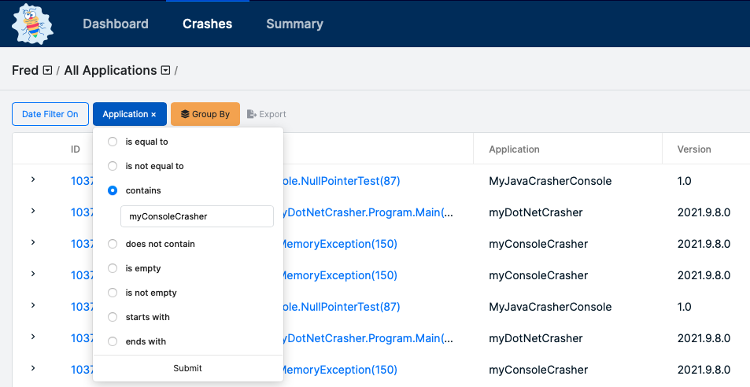

# myConsoleCrasher \(C++\)

Before you enable your native Windows application with BugSplat technology, you may want to take a moment to experiment with our `myConsoleCrasher` sample application.

First, login to BugSplat with user name `fred@bugsplat.com` and password `Flintstone`.

All of the crash reports in the `fred@bugsplat.com` account are actual crashes created with our sample applications. Reports from `myConsoleCrasher` are mixed in with reports from other applications on the [Crashes](https://app.bugsplat.com/v2/crashes) page.

To view just the `myConsoleCrasher` crashes, filter using the drop-down menu in the header of the application column:



Next, download the BugSplat Microsoft Windows Native C++ SDK from the [Downloads](https://www.bugsplat.com/docs/sdk/) page. Once the SDK has downloaded, right click `BugSplatNative.zip` and choose and `Extract All`. Failing to extract the contents from the zip will result in numerous build failures. Once the contents of `BugSplatNative.zip` have been extracted navigate to the `samples` folder and open the `myConsoleCrasher.vcxproj` file with Visual Studio.

Rebuild the project and run it outside of the Visual Studio debugger \(Ctrl+F5\). This is important since the debugger interferes with the BugSplat library’s exception handling. You should see a dialog such as that shown below \(make sure to type something describing the crash so that you can identify it on the website\):


Click the `Send Error Report` button and voilà! The report will be sent! On the BugSplat website while logged in to the `fred@bugsplat.com` account, look for the crash report with the description you entered.

You also can easily modify `myConsoleCrasher` so that crash reports are sent to a database in your account instead. Just modify the following line in `myConsoleCrasher.cpp`, changing `Fred` to the name of your database:

```text
mpSender = new MiniDmpSender(L"Fred", L"myConsoleCrasher", L"1.0", NULL);
```

Finally, experiment with other features of the library by examining the `myConsoleCrasher` source code and supplying different command-line arguments.

## Further Information



