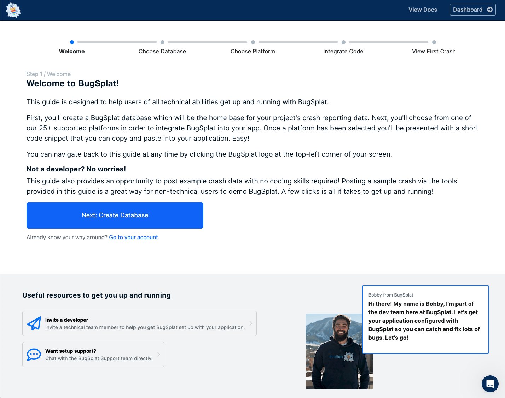
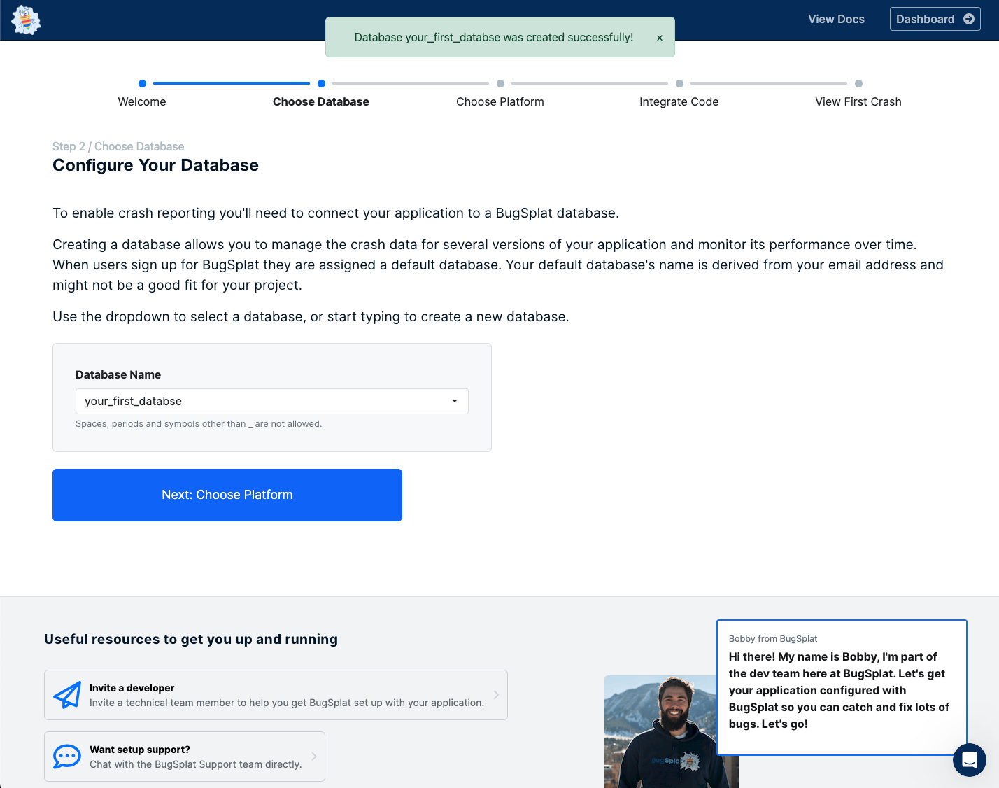
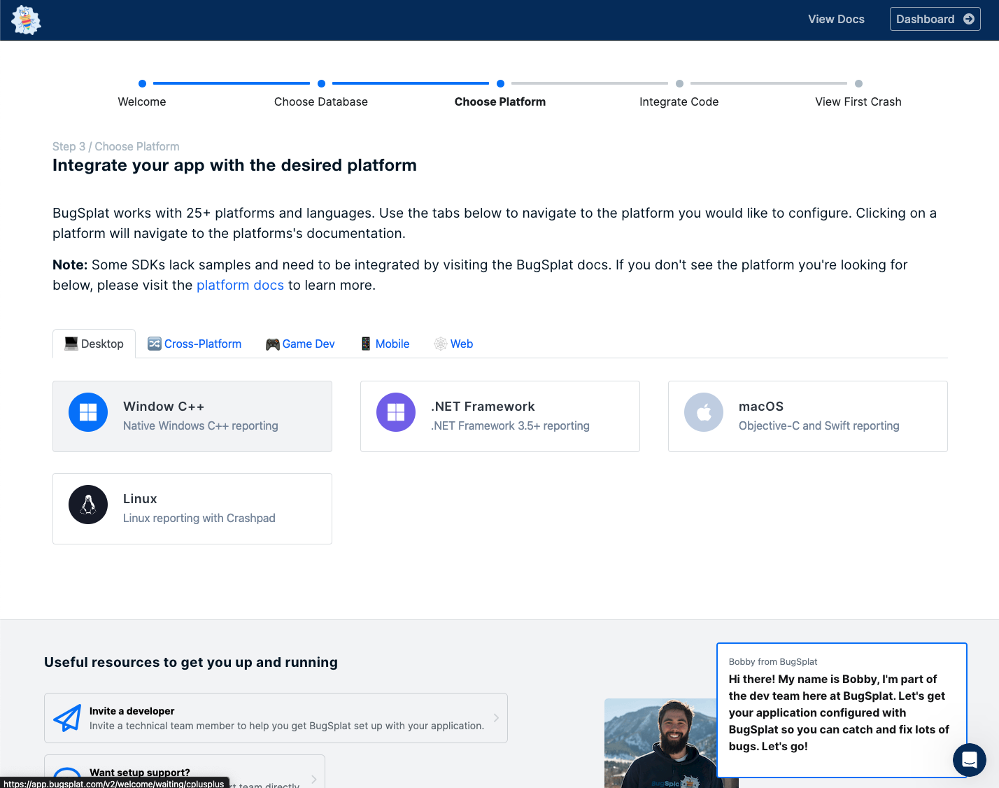
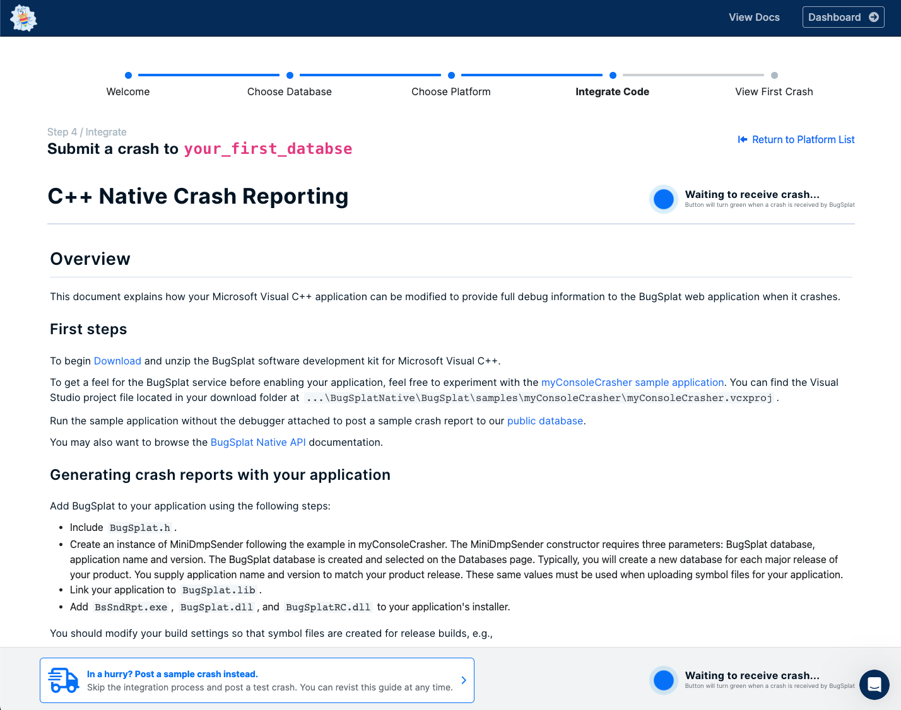
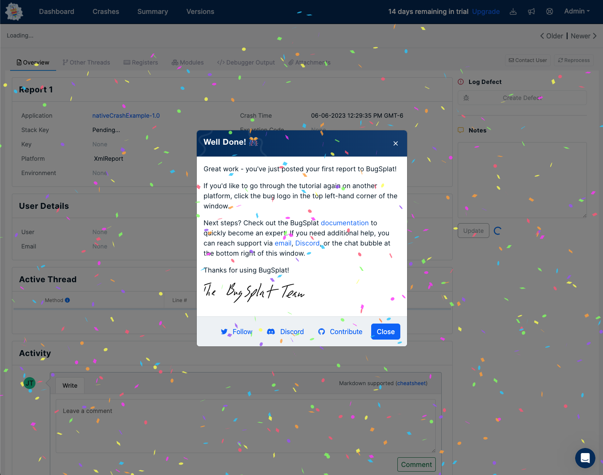

# Quickly Submitting Your First Crash in Under 5 Minutes

Submitting a sample crash to your new BugSplat account is a quick and straightforward process that can be completed in under 5 minutes. Follow the steps below to get started easily:

### Step 1: Sign Up for a New Account

First, sign up for a free BugSplat account at [https://app.bugsplat.com/v2/sign-up](https://app.bugsplat.com/v2/sign-up). Fill in the required information, including your email address and a secure password. Once you've successfully signed up, you'll be ready to proceed to the next step.

<figure><figcaption></figcaption></figure>

### Step 2: Use the Onboarding Tool to Create a New Database

After signing up, you'll be directed to the BugSplat onboarding tool. This tool is designed to make the setup process as seamless as possible. Follow the prompts to create a new database for your application, ensuring you have all the necessary information to set up crash reporting effectively.

<figure><figcaption></figcaption></figure>

### Step 3: Select Your First Platform or SDK

BugSplat supports [a wide range of platforms and SDKs](integrations/), providing comprehensive crash reporting capabilities. Choose your platform or SDK from our extensive list of over 25 options. Select the one that matches your application's development environment.

<figure><figcaption></figcaption></figure>

### Step 4: Submitting a Sample Crash

Once you've selected your platform or SDK, you'll be taken to our documentation page. To quickly submit a sample crash without going through the full integration process, scroll down to the bottom right of the page and click the button labeled "**In a hurry? Post a sample crash instead**." This allows you to skip the full integration process for now and submit a sample crash directly.

<figure><figcaption></figcaption></figure>

### Step 5: Explore Your New BugSplat Account

Congratulations! You've successfully submitted a sample crash to your new BugSplat account. Take a moment to explore your BugSplat account and discover the valuable data you can obtain from a crashed application. This data will empower you to identify and resolve issues in your software more efficiently, saving you time and energy in the long run.

Remember, if you want to navigate back to the onboarding flow and complete the full integration process with BugSplat, you can do so at any time by clicking the BugSplat logo in the top left corner of the screen.  You can also click this link --> [https://app.bugsplat.com/v2/welcome](https://app.bugsplat.com/v2/welcome)

<figure><figcaption></figcaption></figure>

### Additional Resources

If you want to learn more about integrating your application fully with BugSplat, we recommend visiting our SDK integration documentation on our [Platforms and SDK's page](integrations/). These resources provide in-depth guides and step-by-step instructions to help you seamlessly integrate BugSplat into your development workflow.

If you ever hit a bump - please reach out to our responsive support team at [support@bugsplat.com](mailto:support@bugsplat.com)
