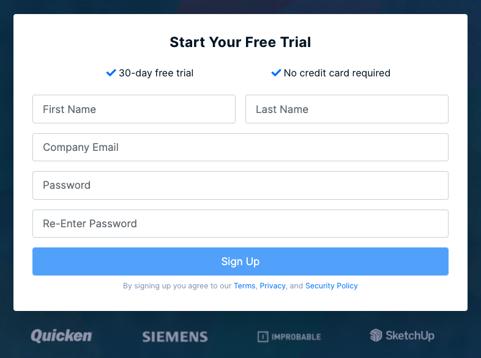

# Signing Up

To register an account with BugSplat, visit the [Sign Up](https://app.bugsplat.com/v2/sign-up) page and enter in your company email or another email you wish to be associated with your account.

Once you've hit **Sign Up** you'll be a registered user of BugSplat. &#x20;

Then, you'll be presented with a screen welcoming you to BugSplat.  Here you can either go through a guided onboarding which aids in quickly configuring new accounts, or you can skip the onboarding and go directly to the [Dashboard](../development/using-the-app.md#dashboard) page.


🤝 **Looking to get access to an existing team?** You can request access from a team member using this form [here](https://app.bugsplat.com/v2/sign-up/team-access). Learn more about requesting access [here](../../administration/introduction/requesting-access-to-your-teams-accounts.md).

