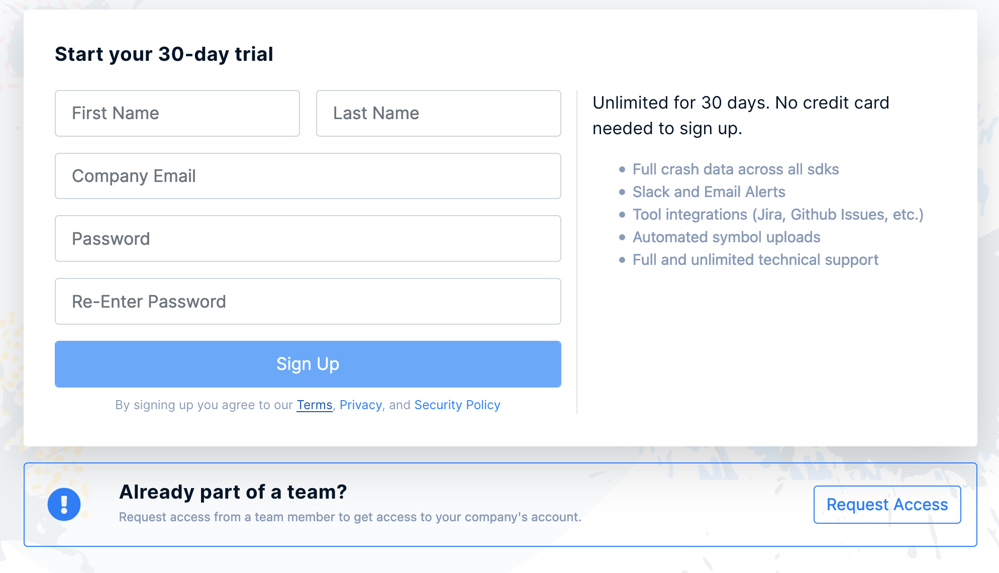
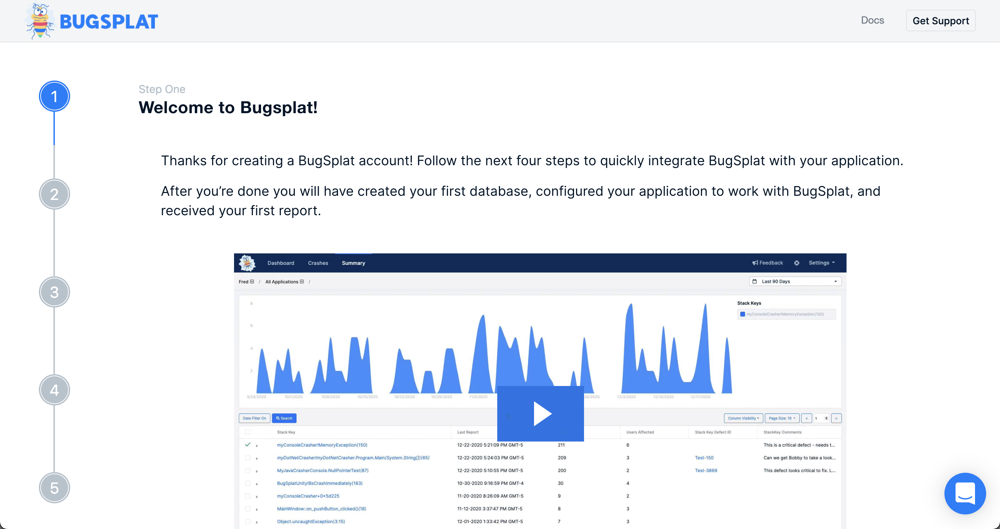

# Signing Up

To register an account with BugSplat, visit the [Sign Up](https://app.bugsplat.com/v2/sign-up) page and enter in your company email or another email you wish to be associated with your account.

Once you've hit `Sign Up` you'll be a registered user of BugSplat.  

Next you'll be presented with a screen welcoming you to BugSplat.  Here you can either go through a guided onboarding which aids in quickly configiruing new accoungs, or you can skip the onboarding and go directly to the Dashboard page.

