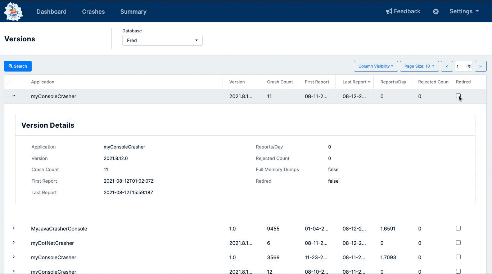

# Retiring Versions

If needed, you can retire old versions of your application using the [Versions](https://app.bugsplat.com/v2/versions) page.  Crash reports from retired versions are not processed by BugSplat, nor do they contribute to your crash volume.  

Since retired crash reports are essentially invisible to you, we suggest retiring versions only if you no longer support that version of the product.  

