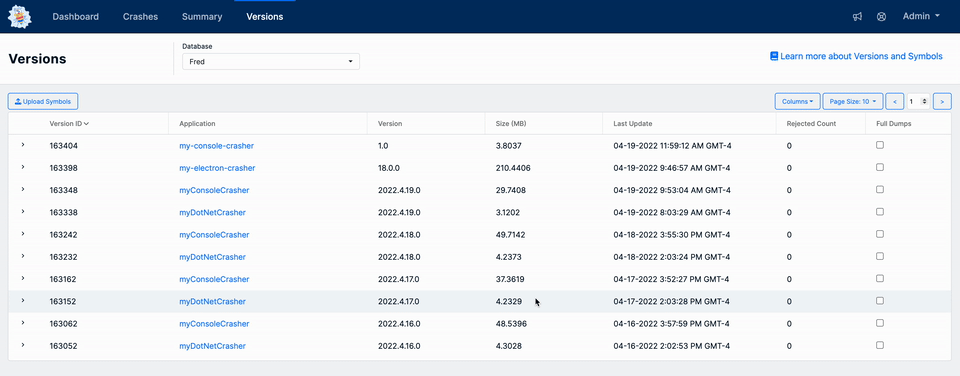

# Managing Versions

### Adding and Removing Symbols

Symbol files can be added and removed via the [Versions](https://app.bugsplat.com/v2/versions) page. Symbol files are required for BugSplat to display call stacks with function names and line numbers. BugSplat will automatically clean up symbol files that are not being used and, most of the time, you will not need to remove symbol files manually. If you uploaded incorrect symbol files, uploaded duplicates, or have uploaded extraneous symbol files we recommend removing unnecessary files so that BugSplat can process your crashes as fast as possible.

Symbols are typically uploaded using command line tools (such as [SendPdbs](../../education/faq/using-sendpdbs-to-automatically-upload-symbol-files.md)) as part of your build process. If you'd like to manually add Symbol files, you can use the **Upload Symbols** button to upload symbols for a new version or expand a row to upload symbols to an existing version. More information about manually uploading symbols can be found [here](../development/working-with-symbol-files/how-to-manually-upload-symbols.md). To remove symbol files, expand a row which corresponds to the version you'd like to remove and click the **Delete** button.

 (1).png>)

### Retiring Versions

If needed, you can retire old versions of your application using the [Versions](https://app.bugsplat.com/v2/versions) page. Crash reports from retired versions are not processed by BugSplat, nor do they contribute to your crash volume. &#x20;

Since retired crash reports are essentially invisible to you, we suggest retiring versions only if you no longer support that version of the product.

.gif>)

### Full Dump Support

BugSplat's [Native](../getting-started/integrations/desktop/cplusplus/) and [.NET Framework](../getting-started/integrations/desktop/windows-dot-net-framework.md) SDKs support the creation of [Full Memory Dumps](../getting-started/integrations/desktop/cplusplus/full-memory-dumps.md). Full Dump support can be added to your subscription for an additional cost. We recommend only enabling Full Dump support on an as-needed basis to ensure end-user crash uploads and processing happens quickly. If interested in Full Memory Dumps please contact [support](../../administration/contact-us.md).\
\
Once Full Dump support has been added to your account, you can enable it on a per-version basis. First, navigate to the [Versions](https://app.bugsplat.com/v2/versions) page, click the **Columns** button and ensure the **Full Dumps** column is visible. Next, click the checkbox for the version generating Full Memory Dumps. Finally, you will need to ensure your application has configured BugSplat to generate Full Memory Dumps when this setting is enabled.

For more information on how to configure the BugSplat SDK to generate Full Memory Dumps please see this [doc](../getting-started/integrations/desktop/cplusplus/full-memory-dumps.md).

