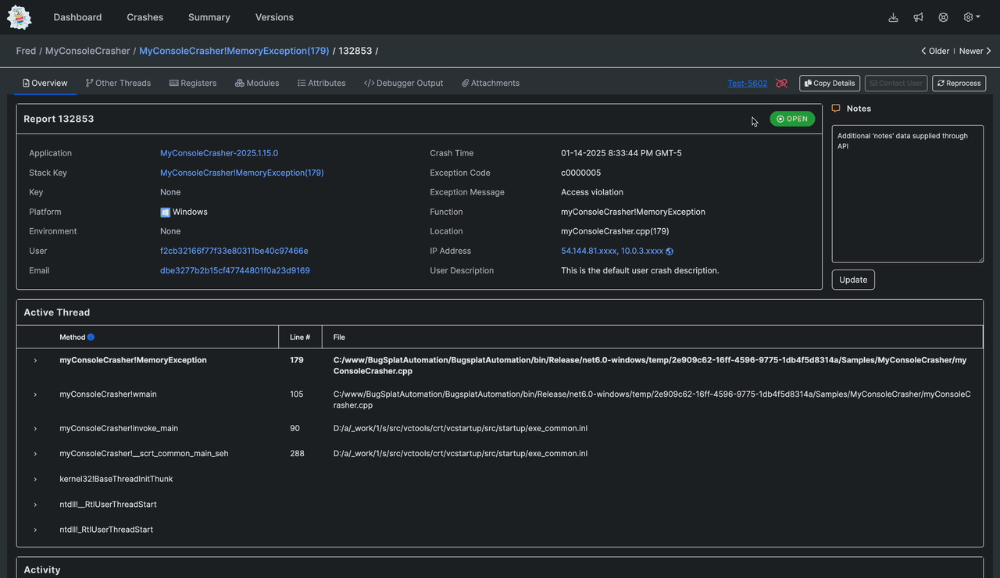
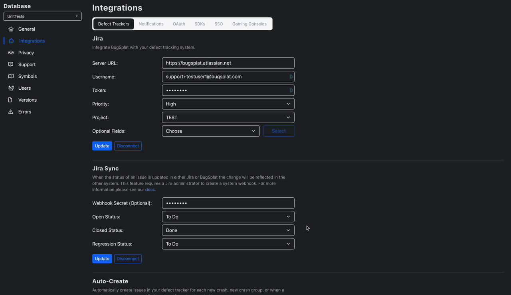

# 🆕 Regression Alerts

BugSplat can be configured to notify developers when a defect marked as Closed recurs in a newer version of their software. Crash groups can have one of three statuses: Open, Closed, and Regression. A regression happens when a crash group is marked as closed, but an instance of the crash occurs in a newer version.

In BugSplat, developers can update the status of a group by clicking the Open, Closed, or Regression badge and selecting a new status.

<figure><figcaption>
Set the Status of a Group to Closed
</figcaption></figure>

When a group's status is set to Closed, BugSplat notes the latest version of the application. If the same crash arrives at BugSplat from a newer version, BugSplat considers this a regression and sets the status from Closed to Regression accordingly.

### Alerts

BugSplat can be configured to send a [notification](../development/integrating-with-tools/) via [Discord](../development/integrating-with-tools/messanger-apps/discord.md), [Teams](../development/integrating-with-tools/messanger-apps/microsoft-teams.md), or [Slack](../development/integrating-with-tools/messanger-apps/slack.md) when a regression occurs. Follow the links in the notifications documentation and choose the Regression Alerts option once you've connected to your favorite messaging platform.

### Defect Tracker Sync

If you're using [Jira](../development/integrating-with-tools/issue-trackers/jira.md), BugSplat can be configured to update the status of linked issues. On the [Defect Trackers](https://app.bugsplat.com/v2/database/integrations?database=Fred#defect-trackers) page set the status you'd like BugSplat to set on Jira when a crash is identified as a regression.

<figure><figcaption>
Mapping the Jira Regression Status
</figcaption></figure>
