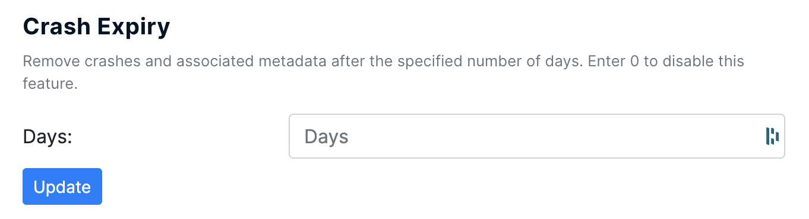

# Crash Expiry

By default, BugSplat stores crash data for a full calendar year \(365 days\). We believe that this gives our users a valuable window to fix difficult crashes, track stability trends, and improve the performance of an application.

However, for users who require crash data to be stored for a shorter amount of time, we have the option to specify a shorter retention period using the "Crash Expiry" option.

To use this feature, users should navigate to the [Options](https://app.bugsplat.com/v2/options) page and set the limit for crash retention data using the Crash Expiry tool.

