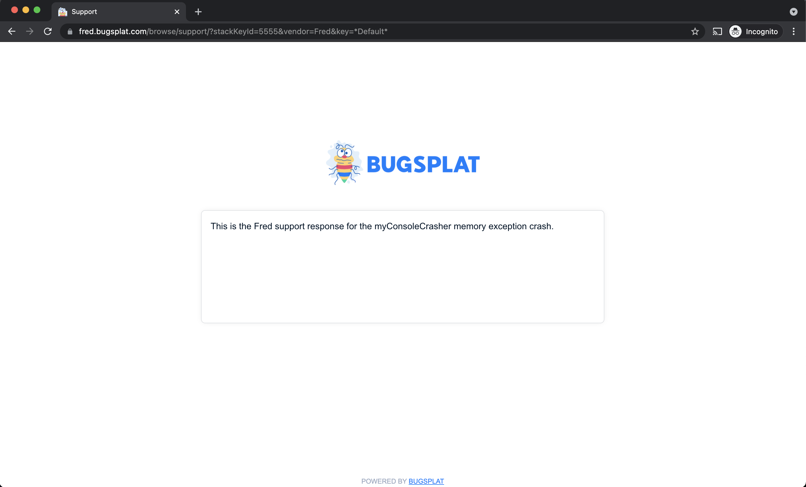

# Support Responses

A custom support response is a message displayed to an end user as a new tab in their default browser. BugSplat can be configured to display these messages automatically and their content can be based upon the type of crash submitted. The message can also be branded with your company or application logo.  

A custom support response allows you to send targeted information to users in the moments immediately after they experience a known crash type.

For example, do you know a particular crash is associated with a bug fixed in a newer version?

The support response can target users who are experiencing this crash and encourage them to upgrade.

The support response can also provide a default message used in the absence of a crash-type specific message. 

### Creating a Crash-specific Support Response

Navigate to the desired “Key Crash” page by clicking a [stack key](../../education/bugsplat-dictionary.md#stack-key) link from any crash report or from the “Summary” page.

Once on the desired “Key Crash” page, click the "Support Response" button. This will bring you to the “Support Response” page. Here you can craft your crash-specific support response.  

To define the message, enter a subject in addition to the message that your users will see after they submit a crash of this type.

To style the message, use Markdown. If you don't remember Markdown off the top of your head, check out this [cheat sheet](https://www.markdownguide.org/cheat-sheet/).  

Once you've defined your message, you can preview it using the button on the page's bottom left.

If the message or subject is left empty, the default tech support response \(if one is defined\) will be shown to users submitting crash reports.

Note: The application key is set at runtime by your application and can be used to provide different messages for the same crash type. For example, the application key could be used to identify localized versions of a product and, in turn, localize versions of the support response. 

For more information about how to localize your support response, please see this [doc](../../education/faq/localized-support-responses-for-windows-c++-.net-and-macos.md).

### Setting the default response

The default support response is displayed if there is no [stack key](../../education/bugsplat-dictionary.md#stack-key)-specific message for a given crash report.‌

To configure the default response, click the "Edit Default Response" button found on the “Support Response” page.‌

Just like other support responses, the default response also attempts to match the application key. In cases where the application key support response isn't defined, the default application key message is displayed.

